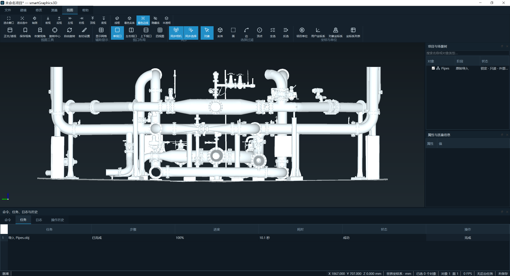

# smartGraphics3D

[English](README.en.md) | 简体中文

smartGraphics3D 是一个基于 C++17、Qt 5.12.10 和 OpenCascade 7.7.0 的 Windows x64
桌面 3D CAD 应用。当前版本为 `v0.1.0-beta.1`，重点覆盖可靠的 CAD 文件交换、实体建模、
测量、多视口和大规模重复零件的低内存显示。



上图为实际软件界面，展示了 Ribbon 工具栏、三维视口、项目与场景树、属性面板以及后台
任务列表。视口中的管线示例模型来源于网络，仅用于界面展示，模型文件不随仓库分发。

## 核心亮点：AIS 共享显示实例

CAD 装配、阵列和重复标准件经常包含大量相同几何。普通复制虽然可以复用底层
`SKernelShape`，但每个对象仍会创建独立 `AIS_Shape`，显示三角网格和 Graphic3d 资源会
随复制数量持续增长。

smartGraphics3D 为此提供两种明确区分的复制方式：

| 方式 | 快捷键 | AIS 结构 | 适用场景 |
| --- | --- | --- | --- |
| 普通复制 | `Ctrl+D` | 每个对象一个独立 `AIS_Shape` | 后续需要独立几何编辑 |
| 共享显示实例 | `Ctrl+Shift+D` | 一个 `AIS_Shape` 原型和多个 `AIS_ConnectedInteractive` 实例 | 阵列、标准件和重复装配 |

共享模式不是把业务对象合并为一个对象。每个实例仍保留独立的对象 ID、变换矩阵、可见性
和选择状态，选择实例后仍能定位到对应业务对象。平移和旋转只更新实例矩阵；缩放或拓扑
编辑会物化独立 Shape 并解除共享。颜色、透明度或显示条件不同的对象会自动拆分显示原型，
避免错误共用外观。

```text
普通复制：对象 1 ─ AIS_Shape 1 ─ 显示几何 1
          对象 2 ─ AIS_Shape 2 ─ 显示几何 2
          ...
          对象 N ─ AIS_Shape N ─ 显示几何 N

共享实例：对象 1 ─ AIS_ConnectedInteractive 1 ┐
          对象 2 ─ AIS_ConnectedInteractive 2 ├─ AIS_Shape 原型 ─ 一份显示几何
          ...                                  │
          对象 N ─ AIS_ConnectedInteractive N ┘
```

### 共享后的实测优化

正式压力模型由项目确定性生成，单份包含 5000 个实体和 2,342,442 个显示三角形。测试
分别显示 1、2、5、10 份；每个模式在全新 Release 进程运行 3 次并取中位数。10 份结果
如下：

| 指标 | 普通复制 | 共享显示实例 | 变化 |
| --- | ---: | ---: | ---: |
| Private Bytes | 1950.91 MiB | 499.99 MiB | **-74.37%** |
| Working Set | 998.65 MiB | 416.64 MiB | **-58.28%** |
| 估算 GPU 几何 | 1876.50 MiB | 187.65 MiB | **-90.00%** |
| 首次显示 | 18099.88 ms | 8563.87 ms | **-52.69%** |
| 30 帧重绘 | 950.41 ms | 950.69 ms | 基本不变 |
| 独立/原型/实例 | 10/0/0 | 0/1/10 | 真实 Connected 结构 |

这组数据说明，共享模式最主要的收益是减少重复显示几何、降低进程内存并缩短首次显示
时间。10 份相同模型只保留一份可共享显示几何，因此“估算 GPU 几何”降低 90%。

理论上，N 份相同显示几何可共享部分的降低比例为：

```text
1 - 1 / N
```

因此 2、5、10 份时理论值分别是 50%、80%、90%，并不是固定减半。进程内存还包含 Qt、
OCCT、基础拓扑、选择 Owner、实例变换和 Connected 连接结构，所以 Private Bytes 和
Working Set 不会完全按该公式下降。

需要特别说明：

- “估算 GPU 几何”按统一的 84 字节/三角形计算，不是显卡驱动实测显存。
- 30 帧重绘时间基本不变；共享实例优化内存和首次创建成本，不代表帧率会成比例提高。
- 基准使用正式的 `S3dDocument`、`SOccViewport` 和场景同步实现，但直接构造最终文档
  对象，不包含用户点击复制、预览和确认的完整 GUI 流程。
- 单个可见成员会退化为独立 `AIS_Shape`；只有两个及以上兼容成员才建立共享原型。

完整测试方法、1/2/5/10 份数据和复现命令见
[实例复制基准说明](sgraphBenchmarks/instanceCopy/README.md)，正式原始数据和报告见
[HTML 测试报告](sgraphBenchmarks/instanceCopy/results/20260727-2/report.html)。

## 主要功能

- 导入和导出 STEP、IGES、BREP、STL、OBJ。
- 导入 STEP、IGES 的模型级/零件级/面级纯色与透明度，以及 OBJ/MTL 纯色材质。
- 创建长方体、圆柱、圆锥、球体和圆环体。
- 布尔、圆角、倒角、孔、镜像、移动、旋转、缩放和普通/共享阵列。
- 对象、实体、面、边、点选择，以及距离、角度、半径、面积、体积和包围盒测量。
- 正交/透视、标准视角、单/双/四视口、同步相机、剖切和渐进显示质量。
- 文档事务、100 步撤销/重做、快照、自动恢复和 `.sg3d` 项目文件。
- 整体颜色覆盖和恢复导入颜色；拓扑不变操作保留面颜色。

## 项目格式

smartGraphics3D 使用 `.sg3d` 保存几何、场景对象、显示样式、单位、坐标系、操作历史和
命名快照，并使用 `.sg3d.autosave` 保存自动恢复副本。项目格式 Magic 为 `SGRAPH3D`，
当前格式版本为 3。

旧扩展名、旧 Magic 和旧项目格式会被明确拒绝，不执行隐式迁移。项目重开后会保留操作
记录和命名快照，但运行时 Ctrl+Z 撤销栈不会跨进程恢复。

## 快速构建

前置条件：

- Windows 10/11 x64；
- Visual Studio 2022，安装“使用 C++ 的桌面开发”和 Windows SDK；
- Qt 5.12.10 MSVC x64 Kit；
- OCCT 7.7.0 x64 SDK，或项目工具链包。

```powershell
python scripts/build/build_64_debug.py --occt-root C:\SDK\occt-7.7.0
python scripts/build/build_64_release.py --occt-root C:\SDK\occt-7.7.0
```

脚本会自动查找 VS、Qt、CMake、Ninja 和 OCCT，执行编译与 7 项测试，并把 Qt 平台插件
及实际使用的 OCCT DLL 部署到：

- `build/64/debug/bin/smartGraphics3D.exe`
- `build/64/release/bin/smartGraphics3D.exe`

Qt 未找到或版本/位数不匹配时，脚本会列出被检查和拒绝的候选。可使用 `--qt-root`、
`SMARTGRAPHICS3D_QT_ROOT` 或 `QTDIR` 明确指定。

## 文档

- [使用说明](sgraphDocs/USAGE.md)
- [代码架构](sgraphDocs/ARCHITECTURE.md)
- [编译与工具链](sgraphDocs/BUILDING.md)
- [测试与性能复现](sgraphDocs/TESTING.md)
- [发布验证记录](sgraphDocs/RELEASE_VALIDATION.md)
- [第三方声明](THIRD_PARTY_NOTICES.md)
- [变更记录](CHANGELOG.md)
- [安全策略](SECURITY.md)

当前为 Beta 版本，不承诺项目格式向后兼容。仓库不包含 Qt、OCCT SDK、构建产物或客户
模型。

Copyright © 2026 huangjiaxin. All rights reserved.
