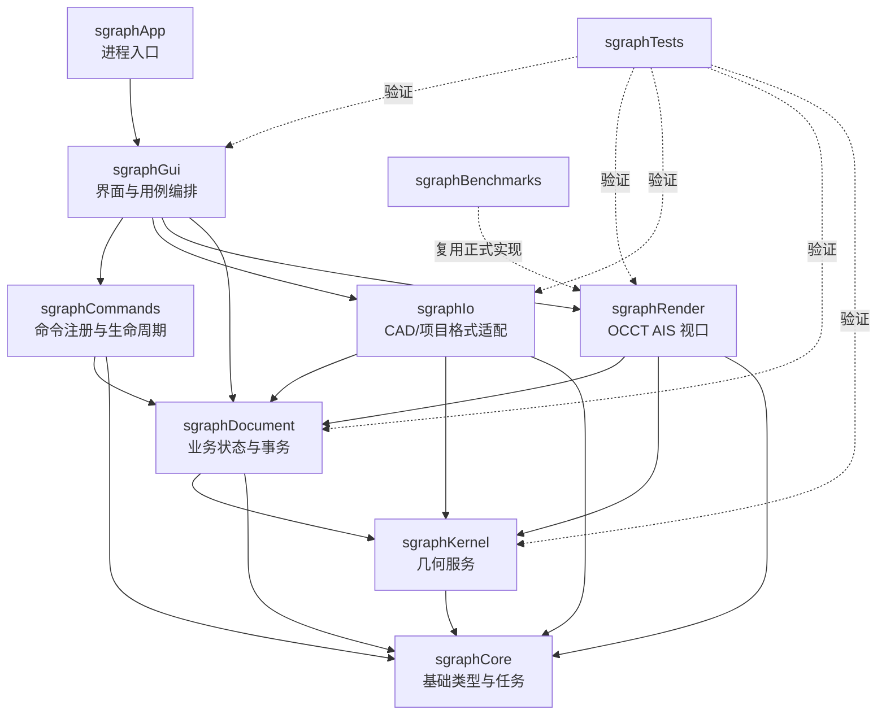
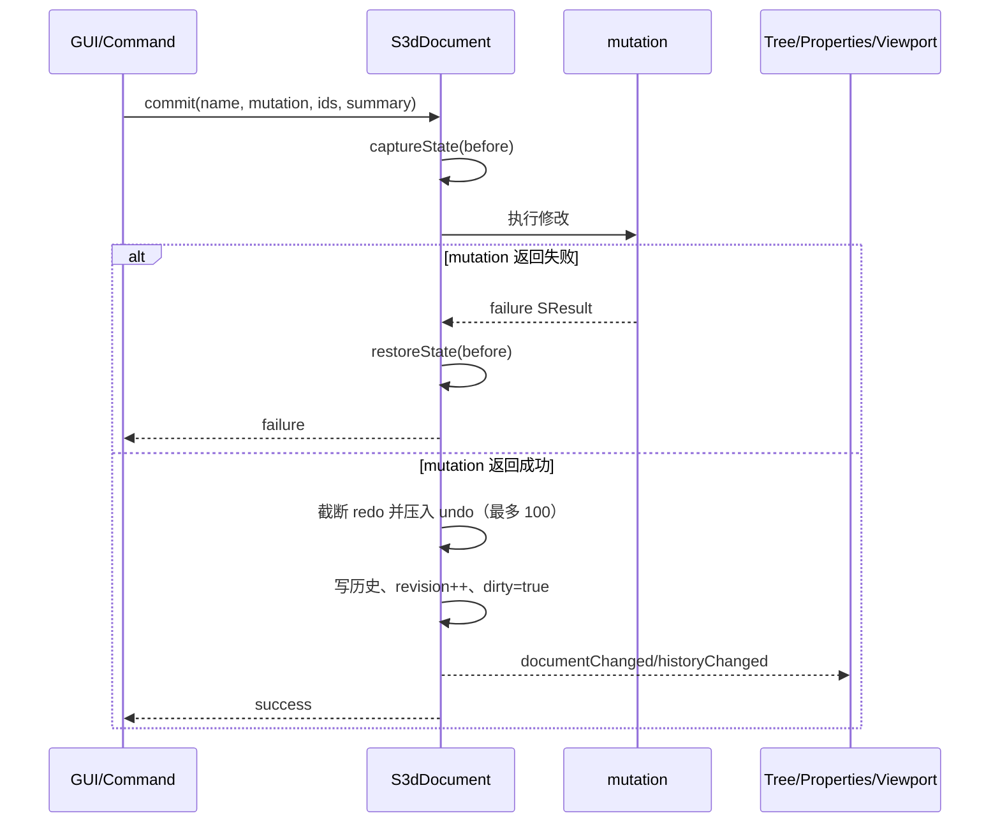
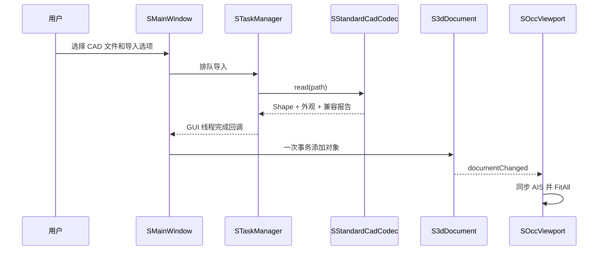
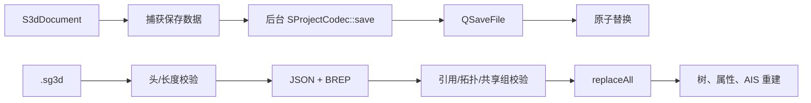
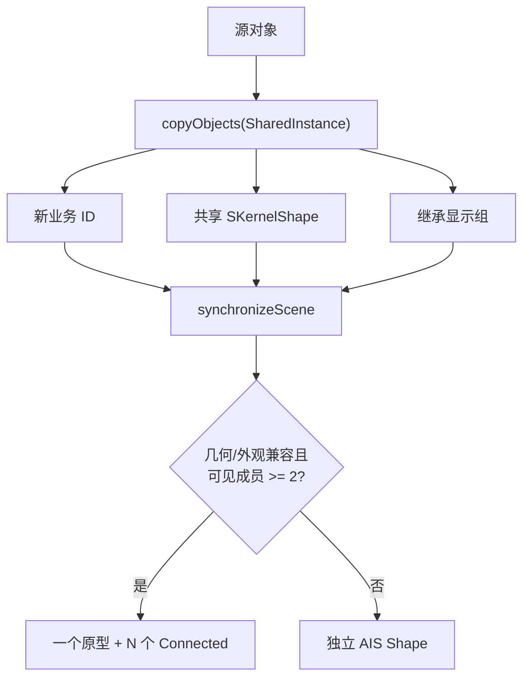
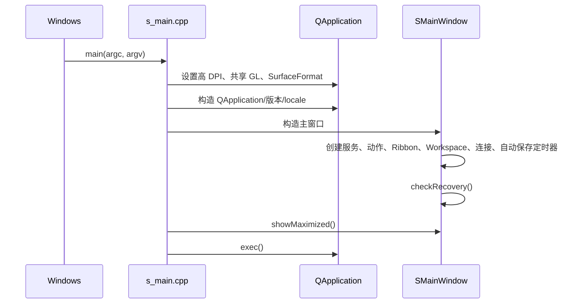
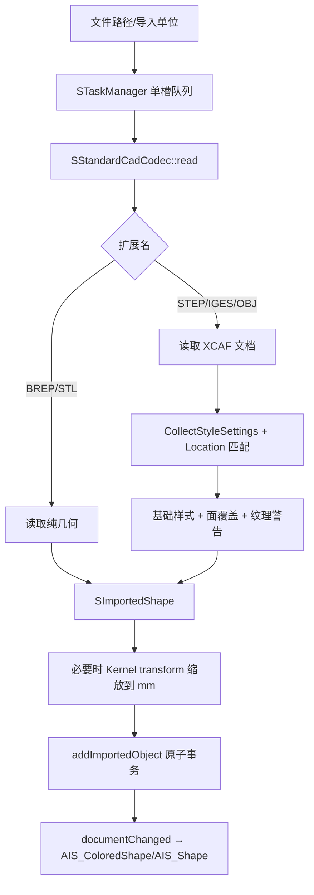
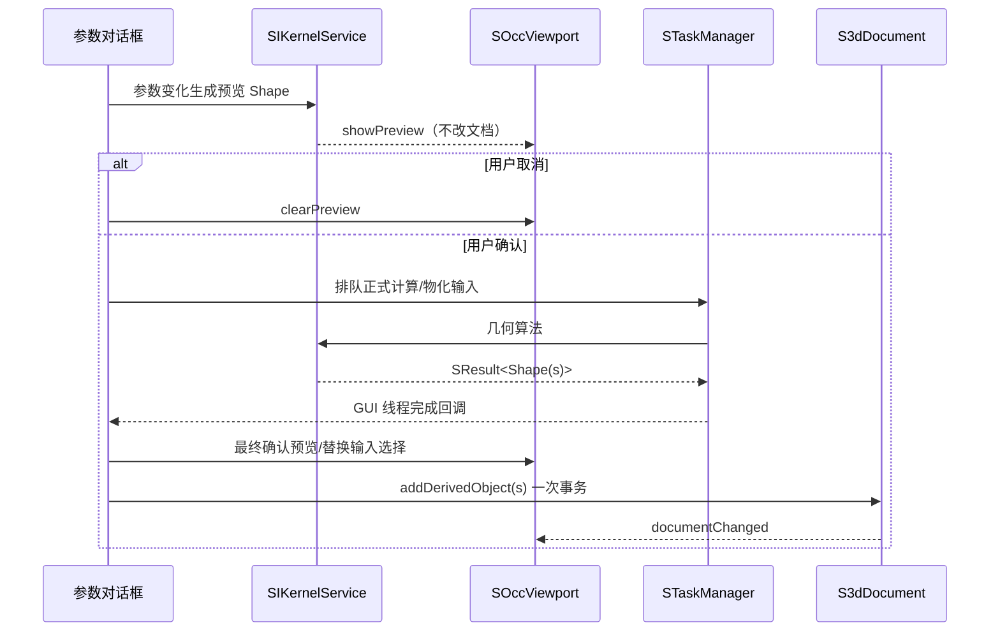
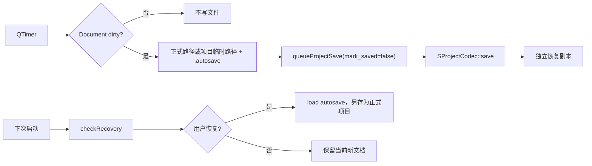

# smartGraphics3D 代码架构

本文是 smartGraphics3D 唯一的代码架构总文档，面向需要阅读、维护、测试或扩展项目的
开发者。文档采用“系统总览 → 模块关系 → 模块内部 → 文件 → 类型 → 关键接口”的总分
结构，并以当前 `v0.1.0-beta.1` 源码为事实来源。简明操作、构建和测试命令仍分别保留在
[使用说明](USAGE.md)、[编译说明](BUILDING.md)和[测试说明](TESTING.md)中；本文负责解释
它们背后的代码组成及关系。

## 0. 阅读地图

- 第 1–2 章从产品和仓库整体解释模块关系、依赖方向与边界。
- 第 3–9 章依次展开 App、Core、Kernel、Document、Commands、IO、Render、GUI；每章都
  给出类型目录、关键接口和逐文件职责。
- 第 10–11 章串联启动、导入、建模、事务、恢复、AIS 和任务的运行时数据流及所有权。
- 第 12–13 章解释 CMake、脚本、配置、测试和性能基准。
- 第 14–15 章说明扩展新功能的方法与当前技术边界。
- 第 16 章提供完整文件覆盖索引，用于维护时反向检查遗漏。

## 1. 架构目标与约束

项目把 CAD 内核、业务文档、界面编排和 AIS 显示分离，目标是同时保证：

- Document 和 GUI 公共接口不暴露 OCCT 类型；
- 每次业务修改作为一个原子事务撤销、重做并记录历史；
- 相同几何既可普通复制，也可通过 AIS Connected 结构共享显示资源；
- CAD 导入、几何计算和保存可在后台运行，主界面保持响应；
- 项目读取在替换当前文档前完成边界、引用和拓扑索引校验；
- Debug、Release 使用同一模块图和测试集合。

| 项目 | 约束 |
| --- | --- |
| 平台 | Windows 10/11 x64，不提供 x86 构建 |
| 语言与 UI | C++17、Qt 5.12.10 MSVC x64 |
| CAD 内核 | OpenCascade 7.7.0 |
| 构建 | CMake、MSVC、CTest |
| 编译检查 | `/W4 /permissive- /Zc:__cplusplus /utf-8` |
| 错误契约 | 公共 API 返回 `SResult<T>`，不向上层传播异常 |
| 源码规则 | 自研 `.h`、`.cpp` 不超过 800 行，接近 700 行按职责拆分 |

### 1.1 产品能力边界

应用提供 STEP、IGES、BREP、STL、OBJ 导入导出，基础实体与布尔/特征建模，对象到点的
选择与测量，多视口、剖切、网格和渐进质量，文档事务、100 步撤销/重做、命名快照、自动
恢复及 `.sg3d` 持久化。STEP/IGES/OBJ 可以导入纯色和透明度；纹理、UV、装配树展开和
外部格式彩色导出不在当前版本范围内。

### 1.2 命名、所有权和异常规则

- 模块目录以 `sgraph` 开头，文件以 `s_` 开头，类型以 `S` 开头，接口以 `SI` 开头，
  私有成员以 `m_` 开头；命名空间统一为 `smartGraphics3D`。
- 控制语句、函数、类型和命名空间使用 Allman 大括号风格，源码采用 UTF-8、LF 和四空格。
- QObject 由父子关系拥有；弱引用使用 `QPointer`；非 QObject 不裸拥有对象。
- 公共接口不传播异常，使用 `SResult<T>`；OCCT `Standard_Failure` 必须在适配层转换。
- OCCT 类型只允许出现在 Kernel、Render、IO 的接口适配或私有实现，不能泄漏到 Document、
  Commands 或 GUI 公共接口。

### 1.3 仓库目录树

```text
smartGraphics3D/
├── sgraphApp/          Qt 进程入口和最终可执行目标
├── sgraphCore/         结果、值类型、单位、坐标、变换和任务
├── sgraphKernel/       OCCT Shape 封装、建模和测量
├── sgraphDocument/     场景对象、事务、历史、快照和复制语义
├── sgraphCommands/     命令接口、回调命令和命令表
├── sgraphIo/           CAD/XDE、项目格式、校验、归档
├── sgraphRender/       OCCT Viewer/AIS、选择、相机和显示资源
├── sgraphGui/          Ribbon、对话框、主窗口用例编排和图标
├── sgraphTests/        七个 Qt Test/CTest 测试目标
├── sgraphBenchmarks/   AIS 共享实例基准、运行脚本和结果
├── sgraphDocs/         架构、使用、构建、测试和发布文档
├── scripts/            Debug/Release 构建和工具链打包
└── CMakeLists.txt      版本、依赖、编译规则和模块装配入口
```

## 2. 总体分层与依赖方向



依赖只向下流动。`sgraphGui` 协调业务模块，但 Document、Commands 不反向依赖 GUI；
Kernel、Render 和 IO 的实现可以包含 OCCT 头，上层只能看到项目值类型和
`SKernelShape` 句柄。

### 2.1 模块职责

| 模块 | 核心职责 | 代表类型或文件 |
| --- | --- | --- |
| `sgraphCore` | 结果、业务枚举、单位、坐标、变换校验、后台任务 | `SResult<T>`、`STaskManager` |
| `sgraphKernel` | Shape 封装、基础实体、布尔/特征、测量、变换物化 | `SKernelShape`、`SIKernelService` |
| `sgraphDocument` | 场景对象、层级、事务、撤销、历史、快照、复制组 | `S3dDocument`、`SSceneObject` |
| `sgraphCommands` | 命令注册、启用状态、预览/确认/取消接口 | `SICommand`、`SCommandRegistry` |
| `sgraphIo` | CAD 导入导出、XDE 外观、`.sg3d`、归档和校验 | `SStandardCadCodec`、`SProjectCodec` |
| `sgraphRender` | AIS 生命周期、选择、相机、剖切、网格、资源统计 | `SOccViewport` |
| `sgraphGui` | Ribbon、场景树、属性、任务、对话框和用例编排 | `SMainWindow` |
| `sgraphApp` | Qt/GL 初始化和主窗口生命周期 | `main.cpp` |
| `sgraphTests` | 七组模块与集成测试 | Qt Test、CTest |
| `sgraphBenchmarks` | 普通/共享显示实例性能基准 | 正式 Document/Render 实现 |

业务模块构建为静态库，最终由 `smartGraphics3D` 可执行程序链接。根 CMake 在配置阶段强制
x64、C++17、Qt 5.12.10 和 OCCT 7.7.0，统一工程的编译与依赖基线。

### 2.2 架构边界的含义

- Core 只能依赖 Qt 基础模块，不能知道文档、几何算法或窗口。
- Kernel 只接受项目参数结构并返回 `SKernelShape`/测量值，上层无法取得原生 Shape。
- Document 可以持有 `SKernelShape`，但不调用 OCCT，不创建 AIS，不显示对话框。
- Commands 只表达命令生命周期，不实现 CAD 算法。
- IO 和 Render 是 OCCT 第二、第三适配边界：前者负责文件，后者负责显示和命中。
- GUI 是用例编排层，可以组合下层服务，但不能复制一套几何、项目格式或场景共享算法。
- App 只负责 Qt 启动参数和主窗口生命周期，不承载业务逻辑。

### 2.3 `sgraphApp`：进程装配模块

上游是操作系统进程入口，下游只有 `sgraphGui`。模块没有业务类型，也不持有文档状态。

| 文件 | 作用 | 关键行为 |
| --- | --- | --- |
| [`sgraphApp/CMakeLists.txt`](../sgraphApp/CMakeLists.txt) | 定义 `WIN32` GUI 可执行目标 | 只编译 `s_main.cpp`，私有链接 `sgraphGui`，输出名固定为 `smartGraphics3D` |
| [`s_main.cpp`](../sgraphApp/s_main.cpp) | 唯一进程入口 | 建立高 DPI/共享 OpenGL Context，设置 24 位深度、8 位模板、4 倍采样，注册应用名和版本，构造并最大化 `SMainWindow` |

`main()` 的生命周期是 `QApplication → SurfaceFormat → SMainWindow → QApplication::exec()`。
新增业务初始化应放入对应服务或主窗口装配过程；入口只适合进程级、必须早于 QWidget 的设置。

## 3. Core：跨模块基础契约

### 3.1 `SResult<T>`

`SResult<T>` 是公共 API 的统一失败通道。成功时携带值，失败时携带稳定错误类别、用户
消息和诊断详情。错误类别覆盖参数错误、未找到、锁定、冲突、取消、不支持、几何失败、
文件失败、数据损坏、版本不兼容和内部失败；`SResult<void>` 提供无返回值版本。

OCCT 适配层捕获 `Standard_Failure`，转换为 `GeometryFailure` 或 `FileFailure`；GUI 根据
结果显示消息并写结构化日志。异常不会穿过 Kernel/IO 边界进入文档或窗口。

### 3.2 业务值类型

核心值类型集中在 `s_types.h`：

- `SObjectId` 使用 `QUuid`，不依赖内存地址；
- `SObjectType` 区分几何、组和测量对象；
- `SObjectStage` 区分原始导入与派生结果；
- `SSelectionMode` 支持对象、实体、面、边、点；
- `SDisplayMode` 描述着色、带边、线框、隐藏线和透明显示；
- `SCopyMode` 区分普通副本和共享显示实例；
- `SDisplayStyle` 保存整体颜色与透明度；
- `SImportedAppearance` 保存导入基础色、回退主色和面级覆盖。

颜色数据只使用 `QColor`、数值透明度和从 1 开始的面索引，不携带 `TopoDS_Shape`，可安全
经过 Document、GUI 和 JSON 持久化。

### 3.3 单位、坐标系与变换

内部几何长度以毫米为基准，界面单位由 `SUnitSystem` 转换。长度支持 mm、cm、m、inch，
角度支持 degree、radian。单位变化属于文档事务。

`SCoordinateSystem` 保存 ID、名称、来源、原点和三个方向。世界坐标系在新文档中自动创建。
`SCoordinateSystemService` 负责坐标系之间的有向变换，避免 GUI 自行拼接矩阵。

`s_transform_utils` 检查矩阵有限性、刚性和相似变换。Render 把 `QMatrix4x4` 转为
`gp_Trsf`；Kernel 在物化 Shape 前再次验证，阻止剪切或退化缩放进入 OCCT 算法。

### 3.4 后台任务

`STaskManager` 使用 `QtConcurrent::run`，通过 `STaskContext` 提供原子取消标志、0–100 进度
和步骤文本。任务管理器有意只启动一个后台执行槽：CAD 算法可能竞争 OCCT 资源，且结果
必须按提交顺序进入文档。若任务结束后检测到取消，结果不会提交；非取消失败可重试。

### 3.5 Core 类型目录

| 类型 | 作用、主要数据和不变量 | 关键接口和调用者 |
| --- | --- | --- |
| `SErrorCode` | 跨模块稳定错误分类；`None` 只表示成功 | Kernel、IO、Document、GUI 统一使用，不把第三方错误码泄漏到上层 |
| `SResult<T>` / `SResult<void>` | 成功值或错误码、消息、详情的互斥结果；默认构造不是成功结果 | 所有公共失败接口；调用方先检查 `operator bool()` 再取值 |
| `SObjectId` | `QUuid` 的业务别名；与内存地址和 AIS Owner 解耦 | Document 生成，GUI/Render/IO 传递和持久化 |
| `SObjectType` | Group、CadShape、Mesh、Measurement、CoordinateSystem | 场景树分类、校验、渲染测量标签分支 |
| `SDataStage` | Original、Working、Published | Document 保护原始对象，GUI 展示阶段 |
| `SSelectionMode` | Object、Solid、Face、Edge、Vertex | Render 激活 OCCT 选择模式，Kernel 解析子形状 |
| `SDisplayMode` | Shaded、Wireframe、ShadedWithEdges、HiddenLine、Transparent | 主窗口动作同步到全部 Viewport，参与显示共享键 |
| `SCopyMode` | 独立 Presentation 或共享 Presentation | Document 决定新显示组，GUI 复制/阵列选择策略 |
| `SDisplayStyle` | 整体颜色、透明度和模式 | 旧项目回退、整体改色和 Render 基础外观 |
| `SAppearanceStyle` | 不含 OCCT 类型的颜色与透明度值 | IO 导入、Document 保存、Render 转为 `Quantity_Color` |
| `SFaceAppearance` | 从 1 开始的面索引和样式 | XDE 压缩生成，项目读取校验，`AIS_ColoredShape` 应用 |
| `SImportedAppearance` | 有效标志、基础样式、拓扑回退样式、面覆盖 | `SSceneObject` 长期保存，整体改色只关闭使用开关而不删除数据 |
| `SCoordinateSystem` | UUID、父坐标系、到父矩阵、来源、校准时间、误差和有效性 | Document 拥有，坐标服务解析链，项目格式持久化 |
| `SSelection` | 业务对象 ID、选择模式、子形状索引 | Viewport 命中输出，主窗口测量输入 |
| `SLengthUnit` / `SAngleUnit` | 项目显示单位枚举 | `SUnitSystem` 转换和项目格式整数校验 |
| `SUnitSystem` | 当前长度/角度单位，无几何所有权 | GUI 格式化，Kernel 入参换算，Document 事务保存 |
| `SCoordinateSystemService` | 无状态坐标链解析器 | `transform()` 解析 source→root→target，检测缺失和循环；`directionLabel()` 生成人类可读方向 |
| `STaskContext` | 共享原子取消标志和线程安全进度回调 | 后台工作函数只读使用；由 `STaskManager` 友元填充 |
| `STaskInfo` | 任务 ID、名称、步骤、进度、可取消性和开始时间 | 通过 Qt signal 交给任务面板 |
| `STaskManager` | 顺序任务队列和可重试任务表 | GUI 创建；`run/cancel/retry`、进度/完成/失败信号；同一时刻只启动一个任务 |

`STaskManager::STaskDefinition` 保存可重跑的工作和完成回调；`STaskState` 保存一次执行的
取消标志、watcher、展示信息和 started 状态。二者位于 `.cpp`，防止并发实现细节进入公共头。

### 3.6 Core 逐文件说明

| 文件 | 主要职责 | 关键接口、数据流和注意事项 |
| --- | --- | --- |
| [`sgraphCore/CMakeLists.txt`](../sgraphCore/CMakeLists.txt) | 定义 `sgraphCore` 静态库 | 公开源码与生成版本头目录，公开链接 Qt Core、Gui、Concurrent |
| [`s_result.h`](../sgraphCore/s_result.h) | 定义统一结果模板和错误枚举 | 纯头文件；`success/failure` 是唯一构造业务结果的入口 |
| [`s_types.h`](../sgraphCore/s_types.h) | 定义跨模块业务值类型 | 不包含 Document/Kernel/OCCT；新增持久化枚举时必须同步项目校验 |
| [`s_unit_system.h`](../sgraphCore/s_unit_system.h) | 声明单位枚举和转换类 | 内部基准长度为毫米、角度为度 |
| [`s_unit_system.cpp`](../sgraphCore/s_unit_system.cpp) | 实现单位倍率、双向转换和后缀 | `millimeterFactor()` 是内部集中倍率表；未知枚举由默认分支安全回退 |
| [`s_coordinate_system.h`](../sgraphCore/s_coordinate_system.h) | 声明坐标变换服务 | 输入是坐标系值集合和两个 UUID，不依赖文档对象 |
| [`s_coordinate_system.cpp`](../sgraphCore/s_coordinate_system.cpp) | 沿父链求根变换并组合 source→target | `transformToRoot()` 检查 ID、无效节点和循环；失败返回 `SResult<QMatrix4x4>` |
| [`s_transform_utils.h`](../sgraphCore/s_transform_utils.h) | 声明仿射、相似、刚性矩阵验证 | 供 Document、Kernel 和 Render 边界复用 |
| [`s_transform_utils.cpp`](../sgraphCore/s_transform_utils.cpp) | 检查有限值、仿射末行、正交轴和统一尺度 | `isRigidTransform()` 在相似基础上要求尺度为 1；使用容差比较浮点轴长和点积 |
| [`s_task_manager.h`](../sgraphCore/s_task_manager.h) | 声明任务上下文、信息、队列 API 和信号 | `Q_DECLARE_METATYPE` 允许任务值跨 Qt 队列连接 |
| [`s_task_manager.cpp`](../sgraphCore/s_task_manager.cpp) | 实现单槽 QtConcurrent 队列、协作取消和重试 | watcher 完成回到管理器线程；进度通过 `QMetaObject::invokeMethod` 排队；取消后的结果不提交 |
| [`s_version.h.in`](../sgraphCore/s_version.h.in) | CMake 版本头模板 | 根 CMake 生成 `s_version.h`，App 和诊断信息读取同一版本字符串 |

扩展 Core 时应先判断类型是否确实跨三个以上模块共享；仅服务于单模块的结构应留在该模块，
避免 Core 变成无边界的公共杂物层。

## 4. Kernel：几何边界

### 4.1 `SKernelShape` PImpl

`SKernelShape` 是跨模块传递几何的轻量值对象，内部以共享 PImpl 持有 OCCT Shape，公开头
不包含 OCCT 类型。复制它只复制共享句柄，不立即复制 BREP/TShape。

`SKernelShapeAccess` 是受控适配入口，仅供 Kernel、Render 和 IO 实现取得或包装原生
`TopoDS_Shape`。Document 和 Commands 因此不需要 OCCT include 路径。

### 4.2 几何服务

`SIKernelService` 提供：

- 长方体、圆柱、圆锥、球体、圆环体和 compound；
- 布尔并/交/差、圆角、倒角和孔；
- 平移、旋转、统一缩放、镜像和截面；
- 对象、实体、面、边、点测量；
- 距离、角度、包围盒、面积、体积和半径；
- 将基础 Shape 与场景矩阵合成为独立 Shape。

实现负责参数、空 Shape、算法完成状态检查和 OCCT 异常转换。应用层把 Shape 视为不可变
基础几何：平移、旋转优先保存场景矩阵；拓扑编辑或独立缩放先物化为新 Shape；几何操作
生成派生对象而不原地修改输入。

### 4.3 Kernel 类型和关键接口

| 类型 | 作用与所有权 | 关键接口、不变量和失败行为 |
| --- | --- | --- |
| `SKernelShape` | 共享 PImpl 值对象，内部 `SImpl` 持有 `TopoDS_Shape` | `isNull()` 判断空 Shape，`isValid()` 调用 OCCT 校验；复制不复制几何，移动安全 |
| `SKernelShapeAccess` | OCCT 适配层的受控后门 | `fromNative/native` 只能在 Kernel、IO、Render 使用；不得从 GUI/Document 调用 |
| `SBooleanOperation` | Union、Difference、Intersection | GUI 动作映射到 `booleanOperation()` |
| `SBoxParameters` | 长、宽、高 | 三个值必须为正 |
| `SCylinderParameters` | 半径、高度 | 两个值必须为正 |
| `SConeParameters` | 底半径、顶半径、高度 | 半径组合和高度在服务实现校验 |
| `SSphereParameters` | 半径 | 必须为正 |
| `STorusParameters` | 主半径、管半径 | 二者必须为正且满足 OCCT 构造要求 |
| `STransformParameters` | 平移、旋转轴/角度、统一缩放 | 旋转轴不能退化，缩放必须为正；返回新 Shape |
| `SHoleParameters` | XY 位置、直径、深度、贯穿标志 | 贯穿时用包围盒计算刀具体；非贯穿深度必须有效 |
| `SSectionParameters` | 平面原点和法向 | 法向不能为零；截面为空时返回几何失败 |
| `SShapeMetrics` | 包围盒、重心、面积、体积和各拓扑数量 | `measure()` 的对象级输出，不持有 Shape |
| `SSubShapeMetrics` | 点、中心、方向、长度、面积、半径及存在标志 | 字段是否有效由 `has_*` 标志表达，避免伪造不存在的量 |
| `SIKernelService` | Kernel 唯一公共服务接口 | 所有算法 const、无共享可变状态；返回项目值类型和 `SResult` |
| `SKernelService` | `.cpp` 内最终实现类 | 由 `createKernelService()` 返回 `unique_ptr<SIKernelService>`，上层不依赖实现类 |

`SIKernelService` 的接口按四组理解：构造类 `make*`，拓扑修改类 `boolean/fillet/chamfer/
makeHole/section`，位置形状类 `transform/materialize/mirror`，查询类 `measure/
measureSubShape/distanceBetween/angleBetween`。所有输入 Shape 只读，成功结果是新值对象。

### 4.4 Kernel 逐文件说明

| 文件 | 主要职责 | 关键实现和调用关系 |
| --- | --- | --- |
| [`sgraphKernel/CMakeLists.txt`](../sgraphKernel/CMakeLists.txt) | 定义 `sgraphKernel` 静态库及 OCCT 私有链接 | 对上公开 Core 和本模块头；OCCT include、TKernel/TKGeom/TKBRep/TKBool/TKFillet 等保持 PRIVATE |
| [`s_kernel_shape.h`](../sgraphKernel/s_kernel_shape.h) | 定义不暴露 OCCT 的 Shape 值句柄 | 仅声明 PImpl 和 `SKernelShapeAccess` 友元；Document 可安全包含 |
| [`s_kernel_shape.cpp`](../sgraphKernel/s_kernel_shape.cpp) | 定义 `SImpl`、值语义和原生 Shape 包装 | `SImpl` 唯一直接拥有 `TopoDS_Shape`；Access 的转换也集中在这里 |
| [`s_kernel_shape_access.h`](../sgraphKernel/s_kernel_shape_access.h) | 声明原生 Shape 桥接接口 | 这个头本身包含 OCCT，使用范围必须受模块边界控制 |
| [`s_kernel_service.h`](../sgraphKernel/s_kernel_service.h) | 参数、测量值、布尔枚举和服务接口 | 是 GUI/Document 可见的主要几何 API；不出现 `TopoDS_*` |
| [`s_kernel_service.cpp`](../sgraphKernel/s_kernel_service.cpp) | 实现全部几何构造、修改、物化和测量算法 | `validateShape()` 统一验证结果；每个入口校验参数并捕获 `Standard_Failure`；文件接近行数上限，新增大功能应拆分 |
| [`s_kernel_measurement_utils.h`](../sgraphKernel/s_kernel_measurement_utils.h) | 声明 Kernel 内部子形状选择和方向提取 | 位于 `kernelMeasurement` 命名空间，接口含 OCCT 类型，不对上层暴露 |
| [`s_kernel_measurement_utils.cpp`](../sgraphKernel/s_kernel_measurement_utils.cpp) | 把选择模式映射为 TopAbs 类型，按一基索引取子形状并求方向 | 被子形状测量、距离和角度复用；拒绝对象模式、越界索引和无方向 Shape |

新增算法必须明确它是否改变拓扑。Kernel 只负责几何结果，面颜色是否保留由 GUI 用例层和
Document 外观规则决定；不要在 Kernel 中引入显示颜色或业务对象 ID。

## 5. Document：业务状态与事务

### 5.1 `SSceneObject`

| 类别 | 主要字段 |
| --- | --- |
| 身份 | `id`、`name`、`type`、`stage`、`parent_id` |
| 几何 | `shape`、`transform`、`derived_from` |
| 来源 | `source_format`、`external_path`、`external_reference` |
| 显示 | `visible`、`display`、导入外观、质量警告 |
| 共享 | `presentation_group_id` |
| 保护 | `locked`、`frozen` |
| 维护 | 数据版本、时间、自定义属性 |

`id` 表示业务身份，`presentation_group_id` 表示显示共享意图。普通复制创建新对象 ID 和新
显示组；共享实例复制创建新对象 ID，但继承显示组。

### 5.2 文档所有权

`S3dDocument` 是已提交业务状态的唯一所有者，维护项目元数据、场景对象、单位、坐标系、
操作历史、命名快照、运行时撤销条目、revision 和 dirty 状态。Render、场景树和属性面板
都从文档投影，不是第二份业务状态。

### 5.3 事务提交



`SDocumentTransaction` 是公开事务包装器，批量导入、多选改色、阵列和多结果派生借此保证
全成或全不成。当前回滚以 mutation 返回失败为边界，`commit()` 没有捕获任意 C++ 异常；
新 mutation 必须遵守公共 API 不抛异常的约束。

### 5.4 撤销、历史和快照

| 机制 | 内容 | 持久化 | 用途 |
| --- | --- | --- | --- |
| Undo/Redo | 修改前后文档状态，最多 100 步 | 否 | 当前会话回退 |
| 操作历史 | 名称、对象 ID、参数摘要和时间 | 是 | 审计和查看 |
| 命名快照 | 对象、单位、坐标系和项目名称 | 是 | 显式恢复节点 |

加载项目时 `replaceAll()` 恢复对象、历史、单位、坐标系和快照，同时清空运行时撤销栈。
所以重开后可查看历史和恢复快照，但不能撤销上次进程中的操作。

### 5.5 层级、保护与派生

父对象必须是 Group，设置父子关系时检查自引用和循环。原始导入对象默认锁定。冻结对象
仍显示，但 Render 停用其选择。锁定、冻结、可见性、隔离和层级调整都通过事务完成。

非破坏性操作生成派生对象（通常属于 `Working` 阶段）并记录输入 ID。保留输入时通常隐藏输入；替换输入时删除
输入，依赖它的测量对象标记质量警告。多输入操作用一次事务，部分失败不会留下半成品。
拓扑保持操作保留导入面色；拓扑变化操作清除面级覆盖，使用源对象主色并记录提示。

### 5.6 Document 类型目录

| 类型 | 主要数据和职责 | 关键接口、生命周期和不变量 |
| --- | --- | --- |
| `SSceneObject` | 业务 ID、父级/坐标系、名称、类型、阶段、Shape、来源、派生关系、矩阵、显示组、外观、状态、时间和 JSON 扩展 | Document 按值拥有；ID 唯一；非组父级非法；显示组 ID 不等于业务 ID |
| `SOperationRecord` | 一条持久化历史的 ID、名称、参数摘要、对象列表、时间、成功/可撤销标志 | commit 成功时追加；历史用于审计，不承担 Undo 状态恢复 |
| `SSnapshotRecord` | 名称、时间、项目名、单位、对象和坐标系完整副本 | 创建快照时复制；同名冲突；恢复会产生新事务 |
| `SDocumentTransaction` | 文档弱引用、操作名、受影响对象、摘要和 finished 标志 | `commit()` 只允许一次；文档销毁、重复提交或取消后提交均失败；析构不隐式提交 |
| `S3dDocument` | 项目身份、单位、坐标系、对象、Undo、快照、历史、dirty 和 revision | 主线程权威状态；对象/单位/坐标修改事务化，名称、路径、dirty 和加载生命周期由明确状态接口维护 |
| `S3dDocument::SDocumentState` | Undo/rollback 捕获的对象、项目名、单位和坐标系 | 不包含文件路径、历史、快照、dirty；仅在 Document 内使用 |
| `S3dDocument::SUndoEntry` | 操作名以及 before/after 状态 | 当前会话最多 100 条；新提交截断 redo 分支 |

`SSceneObject` 的三种身份要分清：`id` 供业务引用，`shape` 代表基础几何，
`presentation_group_id` 只表达显示共享候选。两个对象可以共享 Shape 但不同显示组，也可以
同组却因颜色、透明度或当前可见成员数而暂时不生成 Connected 原型。

### 5.7 `S3dDocument` 关键接口分组

| 接口组 | 方法 | 行为 |
| --- | --- | --- |
| 项目状态 | `projectId/projectName/filePath/isDirty/revision` | 读取项目级状态；文件路径不属于 Undo 快照 |
| 单位坐标 | `setUnits`、`add/removeCoordinateSystem` | 事务化；校验父级、矩阵和引用对象 |
| 对象创建 | `addObject/addObjects/addImportedObject` | 批量方法保证一次 Undo；导入对象和坐标系可原子加入 |
| 派生创建 | `addDerivedObject(s)` | 校验全部输入，处理隐藏/替换输入和测量失效 |
| 复制变换 | `copyObjects/setObjectTransform/presentationGroupMemberCount` | 普通复制换组，共享复制继承组；矩阵必须为有限相似变换 |
| 场景状态 | `remove/rename/visible/locked/frozen/parent/isolate/showAll` | 检查锁定、层级循环和引用后事务提交 |
| 外观 | `setDisplayStyle/setObjectColors/restoreImportedAppearances` | 整体样式关闭导入色；多选改色/恢复原子完成 |
| 会话状态 | `undo/redo/createSnapshot/restoreSnapshot/history` | Undo 只在内存，快照和历史持久化 |
| 生命周期 | `newDocument/replaceAll/markSaved/markDirty` | 新建/加载清空 Undo；加载成功后才整体替换 |

### 5.8 Document 逐文件说明

| 文件 | 主要职责 | 关键实现和副作用 |
| --- | --- | --- |
| [`sgraphDocument/CMakeLists.txt`](../sgraphDocument/CMakeLists.txt) | 定义 `sgraphDocument` 静态库 | 公开链接 Core、Kernel、Qt Core/Gui；不链接 OCCT |
| [`s_scene_object.h`](../sgraphDocument/s_scene_object.h) | 定义场景对象、历史和快照值结构 | 项目格式、GUI、Render 的共同业务模型；不得加入 AIS/OCCT 句柄 |
| [`s_document_transaction.h`](../sgraphDocument/s_document_transaction.h) | 声明一次性公开事务包装器 | 用 `QPointer<S3dDocument>` 防止悬空文档 |
| [`s_document_transaction.cpp`](../sgraphDocument/s_document_transaction.cpp) | 实现提交、取消和 finished 守卫 | 转发到私有 `S3dDocument::commit()`；失败提交也结束事务，禁止重复执行 |
| [`s_3d_document.h`](../sgraphDocument/s_3d_document.h) | 声明文档完整公共 API、信号和内部状态 | 是 Document 主入口；拆分 `.cpp` 仍由同一类实现 |
| [`s_3d_document.cpp`](../sgraphDocument/s_3d_document.cpp) | 基础项目/对象 CRUD、层级、状态、样式和 Undo/Redo | 构造世界坐标系；原始对象默认锁定；删除递归处理子级和依赖测量；发出文档/历史信号 |
| [`s_3d_document_batch.cpp`](../sgraphDocument/s_3d_document_batch.cpp) | 批量对象、导入对象和多派生结果的原子操作 | 先在 mutation 内验证整批 ID/引用，再一次 commit；任何失败回滚全部对象 |
| [`s_3d_document_coordinates.cpp`](../sgraphDocument/s_3d_document_coordinates.cpp) | 单位和坐标系事务 | 拒绝重复 ID、空名称、非法矩阵、缺失父级和仍被对象引用的删除 |
| [`s_3d_document_copy.cpp`](../sgraphDocument/s_3d_document_copy.cpp) | 普通/共享复制、实例矩阵和组成员统计 | 副本继承 Shape、外观和业务字段；普通模式生成新组，共享模式继承源组；变换修改时间 |
| [`s_3d_document_appearance.cpp`](../sgraphDocument/s_3d_document_appearance.cpp) | 多选整体改色和恢复导入外观 | 预先验证全部 ID/锁定/颜色；整体色覆盖关闭 `use_imported_appearance`，但保留原外观数据 |
| [`s_3d_document_state.cpp`](../sgraphDocument/s_3d_document_state.cpp) | 快照、历史、新建、加载替换和通用 commit | `kMaximumUndoEntries=100`；失败 `SResult` 恢复 before；成功写 Undo/历史/revision/dirty 并发信号 |

Document 新功能优先做成可组合的批量事务接口，而不是让 GUI 循环调用单对象方法；后者会
产生多条 Undo，且中途失败无法保持多选操作原子性。

## 6. Commands：命令边界

`SICommand` 把命令生命周期抽象为启用检查、开始、预览、确认和取消。`SCallbackCommand`
用回调包装具体动作，`SCommandRegistry` 以稳定 ID 注册命令。Ribbon、菜单、快捷键和命令
输入框应绑定同一命令或 `QAction`。参数预览只是临时 AIS 对象，确认后才进入事务。

### 6.1 Commands 类型和语义

| 类型 | 作用 | 关键接口和不变量 |
| --- | --- | --- |
| `SCommandContext` | 命令开始时的最小上下文，目前只含非拥有的 `S3dDocument*` | 由 GUI 在触发时构造；命令不得长期拥有文档裸指针 |
| `SICommand` | 统一命令生命周期接口 | `id/displayName/begin/confirm/cancel/hasPreview`；`begin`、`confirm` 返回 `SResult<void>` |
| `SCallbackCommand` | 无预览、立即执行型命令适配器 | 保存稳定 ID、显示名和 begin 回调；begin 设置 active，回调失败或 confirm/cancel 时清除；当前未用 active 拒绝重复 begin |
| `SCommandRegistry` | 命令 ID 到共享实现的注册表 | 拒绝空指针、空 ID 和重复 ID；`command()` 返回非拥有指针，registry 拥有实际命令 |

当前 GUI 的复杂建模预览仍由 `SMainWindow` 用例函数直接编排，Commands 主要统一快捷键、
Ribbon 和命令行入口。若未来把复杂操作完整命令化，应让具体命令拥有预览状态，但仍通过
Document 事务确认，不能直接改 AIS 后假定业务已提交。

### 6.2 Commands 逐文件说明

| 文件 | 主要职责 | 关键实现 |
| --- | --- | --- |
| [`sgraphCommands/CMakeLists.txt`](../sgraphCommands/CMakeLists.txt) | 定义 `sgraphCommands` 静态库 | 公开链接 Core、Document、Qt Core，不依赖 GUI/Kernel/OCCT |
| [`s_i_command.h`](../sgraphCommands/s_i_command.h) | 定义上下文和抽象命令接口 | 是添加新命令实现的稳定契约 |
| [`s_callback_command.h`](../sgraphCommands/s_callback_command.h) | 声明回调命令及 begin 回调类型 | 适合无持久预览状态的立即动作 |
| [`s_callback_command.cpp`](../sgraphCommands/s_callback_command.cpp) | 实现回调存在性检查和生命周期 | 空回调返回内部失败；回调失败时清除 active；`hasPreview()` 固定返回 false |
| [`s_command_registry.h`](../sgraphCommands/s_command_registry.h) | 声明命令注册、查询和 ID 枚举 | 内部用 `shared_ptr` 存储从 `unique_ptr` 转入的所有权 |
| [`s_command_registry.cpp`](../sgraphCommands/s_command_registry.cpp) | 实现注册冲突校验和查找 | 查询未知 ID 返回 `nullptr`；ID 列表来自 QHash keys，不承诺界面顺序 |

## 7. IO：外部格式与项目格式

### 7.1 CAD 适配

| 格式 | 导入 | 导出 | 导入外观 |
| --- | --- | --- | --- |
| STEP/STP | XDE | 精确几何/拓扑 | 模型、零件、实体、面纯色与透明度 |
| IGES/IGS | XDE | 精确几何/拓扑 | 模型、零件、实体、面纯色与透明度 |
| BREP | BRepTools | BRepTools | 无可靠源色，使用默认色 |
| STL | StlAPI | 三角化后二进制 STL | 无可靠源色，使用默认色 |
| OBJ | XDE/RWObj | 三角化后 OBJ | MTL 纯色与透明度；纹理降级提示 |

每次导入和导出生成 `SFileCompatibilityReport`，列出保留、丢失和警告项。外部格式导出不
写回操作历史、测量、场景层级或面级颜色。

STEP、IGES 和 OBJ 通过 XCAF 文档读取。自由 Shape 合并为一个业务对象，当前不展开装配
树。`XCAFPrs::CollectStyleSettings` 收集带 Location 的样式，按实际 Shape 和面映射，
避免同一零件不同实例串色。外观压缩为基础样式、拓扑变化回退主样式和不同面的覆盖。
OBJ 检测到纹理时仍导入几何、纯色和透明度，同时提示不支持纹理、UV 和光照参数。

### 7.2 `.sg3d` 结构

项目格式只接受 `.sg3d` 和恢复用 `.sg3d.autosave`：

```text
Little Endian
┌──────────────────────────────┐
│ Magic: SGRAPH3D              │
│ Format version: 3            │
│ Metadata byte length         │
│ UTF-8 JSON metadata          │
│ Object/Snapshot BREP blocks  │
└──────────────────────────────┘
```

JSON 保存项目、单位、坐标系、对象元数据、显示样式、导入外观、历史和快照；二进制块保存
Shape BREP。元数据最大 64 MiB，单 Shape 最大 2 GiB。写入使用 `QSaveFile` 原子替换。

加载流程：

1. 校验扩展名、Magic、版本和长度上限；
2. 解析 JSON 和每个 BREP；
3. 校验对象 ID、父子引用、坐标系、显示组和面索引；
4. 检查同一显示组的几何一致性；
5. 全部成功后 `replaceAll()`。

旧扩展名、旧 Magic、非版本 3 明确失败，不自动迁移。导入外观是 v3 可选元数据，缺少时
按整体显示色加载。当前保存仍为每个对象写一份 BREP；加载后才按相同显示组和相同数据
复用 `SKernelShape`，所以运行时共享不等于磁盘去重。

### 7.3 恢复、归档和诊断

- 自动恢复写独立 `.sg3d.autosave`，不覆盖正式项目；
- 项目归档创建新目录，包含 `.sg3d`、`dependencies/` 和 `manifest.json`；
- 外部引用若存在会复制到依赖目录，重名文件添加序号；
- 归档在同级临时目录完成后重命名提交；
- `.sgdiag` 保存版本、系统、项目摘要和结构化日志，不保存模型几何。

归档 manifest 当前记录依赖的原始绝对路径，日志也可能包含文件路径。公开发送前应检查并
脱敏。

### 7.4 IO 类型目录

| 类型 | 作用和主要数据 | 关键接口、不变量和调用者 |
| --- | --- | --- |
| `SFileCompatibilityReport` | 格式名、保留属性、丢失属性和警告 | CAD 导入/导出返回，GUI 在执行前后向用户展示 |
| `SImportedShape` | 导入 Shape、建议名称、压缩外观和兼容报告 | `SStandardCadCodec::read()` 输出，主窗口转换为 `SSceneObject` |
| `SIFileCodec` | 几何和项目 codec 的共同抽象 | 默认方法返回 Unsupported；具体 codec 只重写支持的能力 |
| `SStandardCadCodec` | STEP/IGES/BREP/STL/OBJ 几何编解码器 | `extensions/read/write/compatibilityReport`；不保存 Document 业务状态 |
| `SProjectCodec` | `.sg3d`/autosave 保存加载和目录归档 | `save/load/createArchive`；只有完全校验成功才替换文档 |
| `SStyleSetting` | XDE 内部 Shape+Style 临时项 | 只在彩色导入 `.cpp` 使用，用于位置化样式匹配 |
| `SFaceStyleState` | 一个面最终样式、是否来自源文件的临时状态 | 用于统计主色并压缩覆盖，不进入公共 API |
| `SXdeReadRequest` | 扩展名、UTF-8 路径等 XDE 读取参数 | `readDocument()` 选择 STEPCAF、IGESCAF 或 RWObj reader |

`projectValidation` 是函数命名空间而非类：`isValidLengthUnit/isValidAngleUnit` 校验持久化
枚举，`validateCoordinateSystems` 校验坐标图，`validateObjects` 校验业务引用、显示属性、
外观索引和 Shape。`writeColoredXdeTestFixture()` 只在测试构建加入 IO 目标。

### 7.5 项目保存与加载细节

保存先逐对象和逐快照序列化 BREP，同时构造 JSON 元数据，再写 Magic、版本、JSON 长度、
JSON 和 Shape 块。`QSaveFile::commit()` 是唯一正式落盘点。加载为每个显示组维护 BREP 字节
和 `SKernelShape` 映射：同组字节相同则复用，字节不同立即拒绝，防止错误 Connected 共享。

重要 JSON 字段包括项目 ID/名称、单位、坐标系、对象/快照数组、历史、对象类型/阶段、
父级、派生输入、矩阵、显示组、整体 display、`importedAppearance`、外部引用、质量状态、
自定义属性和每个 `shapeSize`。所有新增字段必须同时更新序列化、反序列化、结构校验和测试。

### 7.6 XDE 外观解析细节

`readDocument()` 针对 STEP/IGES 开启 ColorMode，OBJ 使用 `RWObj_CafReader`。自由 Shape 在
`documentShape()` 中合并为一个 compound。`CollectStyleSettings` 收集标签、零件、实例和
面的样式；Location 参与 Shape 映射。面样式集合按颜色/透明度键统计主色，结果压缩为一个
基础样式和少量不同面覆盖；并列结果使用稳定键顺序，保证测试与项目输出可重复。检测到
BaseColorTexture 时不读取图片，向兼容报告追加纹理降级警告。

### 7.7 IO 逐文件说明

| 文件 | 主要职责 | 关键实现、输入输出和失败路径 |
| --- | --- | --- |
| [`sgraphIo/CMakeLists.txt`](../sgraphIo/CMakeLists.txt) | 定义 `sgraphIo` 及 OCCT 文件组件依赖 | 公开 Core/Kernel/Document；私有链接 BREP、Mesh、STEP、IGES、XCAF/XDE；测试开启时加入 fixture |
| [`s_i_file_codec.h`](../sgraphIo/s_i_file_codec.h) | 定义兼容报告、导入结果和 codec 抽象接口 | 默认实现明确返回 Unsupported，使几何 codec 和项目 codec 可共用基类而不伪装能力 |
| [`s_standard_cad_codec.h`](../sgraphIo/s_standard_cad_codec.h) | 声明标准 CAD codec | 公共接口不含 OCCT；兼容报告可在写文件前调用 |
| [`s_standard_cad_codec.cpp`](../sgraphIo/s_standard_cad_codec.cpp) | 分派 STEP/IGES/BREP/STL/OBJ 读取和写入 | STEP/IGES/OBJ 导入走 XDE；STL/OBJ 导出先网格化；中文路径转 UTF-8；捕获 `Standard_Failure` |
| [`s_xde_import.h`](../sgraphIo/s_xde_import.h) | 声明彩色 XDE 导入函数 | 输出统一 `SImportedShape`，不暴露 TDocStd/XCAF 类型 |
| [`s_xde_import.cpp`](../sgraphIo/s_xde_import.cpp) | 读取 XCAF 文档、合并 Shape、解析实例和面样式 | 处理 Surface/Material base color 与 alpha；压缩外观；无几何、reader 失败或 OCCT 异常返回文件失败 |
| [`s_project_codec.h`](../sgraphIo/s_project_codec.h) | 声明项目 codec 和归档 API | `loadProject/saveProject` 适配基类，`save/load` 是明确入口 |
| [`s_project_codec.cpp`](../sgraphIo/s_project_codec.cpp) | v3 容器、JSON/矩阵/外观转换、BREP 序列化和完整加载 | Magic `SGRAPH3D`；元数据 64 MiB、单 Shape 2 GiB；拒绝旧扩展名/Magic/版本和截断数据 |
| [`s_project_validation.h`](../sgraphIo/s_project_validation.h) | 声明项目结构验证函数 | 接受纯 Document/Core 类型，可独立测试 |
| [`s_project_validation.cpp`](../sgraphIo/s_project_validation.cpp) | 校验枚举、颜色/透明度、面覆盖、坐标层级和对象引用 | 拒绝重复/空 ID、循环、非法矩阵、越界面索引、缺失派生或父引用和无效 Shape |
| [`s_project_archive.cpp`](../sgraphIo/s_project_archive.cpp) | 实现 `SProjectCodec::createArchive()` | 要求目标不存在；临时目录保存项目/依赖/manifest，成功后重命名；同名依赖加序号 |
| [`s_xde_test_support.h`](../sgraphIo/s_xde_test_support.h) | 声明测试专用彩色 fixture 生成器 | 只在 `SMARTGRAPHICS3D_BUILD_TESTS` 时进入目标 |
| [`s_xde_test_support.cpp`](../sgraphIo/s_xde_test_support.cpp) | 运行时生成最小彩色 STEP/IGES 测试数据 | OBJ/MTL fixture 由 codec 测试单独写入；避免仓库提交第三方模型；不属于发布版业务入口 |

IO 扩展必须先决定是“几何交换格式”还是“业务项目格式”。前者只输出 Shape/外观/兼容报告，
后者必须完整处理事务语义所需的业务状态；两者不能因都叫文件保存而混为一套代码。

## 8. Render：视口与 AIS 资源

### 8.1 视口能力

`SOccViewport` 封装 Viewer、View、InteractiveContext 和 Qt 原生窗口交互，提供正交/透视、
标准视角、适合全部/选中、旋转/平移/缩放、对象到点选择、多剖切面、世界 XY 网格开关、
显示模式、渐进质量、相机/选择同步和资源统计。初始化前设置的状态先保存，OCCT View 创建
后统一应用；网格等视图辅助状态不进入 Document 或 `.sg3d`。

### 8.2 场景同步

视口监听 `documentChanged`。当前 `synchronizeScene()` 会：

1. 对 Connected 实例执行 `Disconnect()`；
2. 移除实例和独立 Presentation；
3. 移除共享原型、测量标签和预览；
4. 从文档重新分组并创建 AIS 对象；
5. 恢复选择模式、冻结状态并刷新 Viewer。

该策略状态简单一致，但任何文档变化都会全量重建 AIS；增量同步是后续优化方向。

### 8.3 共享显示结构

普通对象对应独立 `AIS_Shape` 或 `AIS_ColoredShape`。共享组只有一个可见成员时也使用独立
Shape；两个及以上兼容成员时建立一个未显示原型和多个 Connected 实例：

```text
业务对象 A ─ AIS_ConnectedInteractive A ┐
业务对象 B ─ AIS_ConnectedInteractive B ├─ AIS_Shape/AIS_ColoredShape 原型
业务对象 C ─ AIS_ConnectedInteractive C ┘
```

分组键包含显示组 ID、底层 TShape 身份、整体颜色、有效透明度、显示模式、导入外观开关
和外观指纹。只有几何与有效外观相同的对象才共享；单实例改色会自动拆组。

清理顺序是 Connected `Disconnect()`、移除实例、移除原型，避免原型先释放留下悬空连接。

### 8.4 彩色 Shape 与选择映射

启用导入外观时创建 `AIS_ColoredShape`，先设置基础样式，再按从 1 开始的面索引调用
`SetCustomColor` 和 `SetCustomTransparency`。共享实例连接同一彩色原型。整体改色关闭
导入外观开关；恢复颜色只重新启用已保存外观，无需重读源文件。

每个显示对象保存业务 ID、实际 Presentation 和源 Shape。命中 Connected 后先确定实例
对象，再用 `IsPartner` 将所选子 Shape 映射到源拓扑，返回对象 ID、选择类型和子形状索引。

### 8.5 渐进质量和统计

三角形超过 200,000 时可在交互中采用较粗偏差，结束后恢复精细质量。资源统计包含独立
Presentation、共享原型、Connected 实例、彩色原型、三角形和 OCCT 原始统计。
`estimated_gpu_geometry_bytes` 按 84 字节/三角形统一估算，不是驱动实测显存。

### 8.6 Render 类型目录

| 类型 | 作用和状态 | 关键接口、所有权和不变量 |
| --- | --- | --- |
| `SRenderQualityPolicy` | 无状态渐进质量策略 | `kLargeMeshTriangleCount=200000`；按交互/精细阶段返回不同 deviation coefficient |
| `SStandardView` | Front/Back/Left/Right/Top/Bottom/Isometric | 主窗口动作和 Viewport 相机方向的项目枚举 |
| `SClipPlane` | 法向、offset、翻转标志 | GUI 对话框编辑，Viewport 转为 `Graphic3d_ClipPlane`；法向需有效 |
| `SRenderResourceStatistics` | 独立/共享/彩色/Connected/Graphic 数、三角形、估算几何和 OCCT 文本 | 基准和状态面板读取；不控制渲染行为 |
| `SOccViewport` | Qt Widget 封装 Viewer、View、Context、输入、选择和场景缓存 | 主窗口拥有；Document 非拥有指针；所有公开 API 使用项目类型 |
| `SDisplayedObject` | 一个业务对象到实际 AIS、源 Shape、connected/progressive/frozen 的映射 | 选择回映和资源统计使用；`source_shape` 对 Connected 指向共享原型 |
| `SSharedPresentation` | 分组键、原型、质量状态和三角形数 | 仅保存组原型；实例在 `SDisplayedObject` 中 |
| `SOccViewport::SImpl` | 全部 OCCT handles、缓存、相机、输入和延迟状态 | `unique_ptr` PImpl 隔离 OCCT 头；Widget 析构前按正确顺序清场 |

`SOccViewport` API 可分为场景绑定、相机视图、显示状态、剖切/网格、选择、预览、延迟状态
查询和资源统计。signals 只发送对象 ID、`SSelection` 和标量状态，不发送 AIS Owner。

### 8.7 Viewport 初始化和输入

`initializeViewer()` 创建 DisplayConnection、OpenGL driver、Viewer、View、InteractiveContext，
把 Qt 原生窗口绑定到 OCCT，并应用初始化前保存的投影、标准视角、网格和剖切状态。
`paintEngine()` 返回空以避免 Qt 绘制引擎覆盖原生 OpenGL；paint/resize/show 驱动 View。

鼠标事件维护 rotating、panning、box_selecting、box_zooming 和 rubber band 状态。交互开始时
`setInteractionQuality(true)` 对渐进对象使用预览偏差，释放时恢复精细偏差并重绘。滚轮在
指针附近缩放。命中完成后 `emitCurrentSelection()` 同时生成对象级 ID 和子形状选择。

### 8.8 Render 逐文件说明

| 文件 | 主要职责 | 关键实现和调用关系 |
| --- | --- | --- |
| [`sgraphRender/CMakeLists.txt`](../sgraphRender/CMakeLists.txt) | 定义 `sgraphRender` 静态库 | 公开 Core/Kernel/Document/Qt，私有链接 TKService/TKV3d/TKOpenGl/TKBRep/TKTopAlgo |
| [`s_render_quality.h`](../sgraphRender/s_render_quality.h) | 声明大网格阈值和偏差策略 | 常量由 Viewport 与测试共享 |
| [`s_render_quality.cpp`](../sgraphRender/s_render_quality.cpp) | 实现渐进选择和交互/精细偏差值 | 纯策略，无 Viewer 状态 |
| [`s_occ_viewport.h`](../sgraphRender/s_occ_viewport.h) | 声明项目值类型视口 API、事件和 signals | GUI 可包含；不暴露任何 OCCT handle |
| [`s_occ_viewport_p.h`](../sgraphRender/s_occ_viewport_p.h) | 定义 Render 私有 AIS/Viewer 数据结构 | 包含 OCCT 头，只由 Render `.cpp` 使用；集中表达 Presentation 所有权 |
| [`s_occ_viewport.cpp`](../sgraphRender/s_occ_viewport.cpp) | 文档绑定、预览、视图/网格/显示/选择控制和状态查询 | 连接 `documentChanged`；初始化前调用只更新请求状态；设置显示模式时更新独立 Shape 和共享原型 |
| [`s_occ_viewport_events.cpp`](../sgraphRender/s_occ_viewport_events.cpp) | Qt 原生绘制、Viewer 初始化和鼠标交互 | 创建 OCCT 窗口；框选/缩放、旋转、平移、滚轮；发相机和选择信号；切换渐进质量 |
| [`s_occ_viewport_scene.cpp`](../sgraphRender/s_occ_viewport_scene.cpp) | 文档到 AIS 的全量投影、彩色 Shape、共享原型、测量标签和统计 | 构造外观指纹和分组键；单成员独立、多成员 Connected；清理先 Disconnect；按 84 B/triangle 估算 |

Render 不得把 AIS 状态反写成文档事实。选择是唯一允许的回流信息，并且必须先转换为业务
ID/子形状索引。新增显示属性时，要同时判断它是否参与共享键，否则可能错误共用原型。

## 9. GUI：用例编排

`SMainWindow` 负责装配而不重新实现几何算法。界面由 Ribbon、多视口、项目与场景树、属性
与质量、命令/任务/日志/历史面板和状态栏组成。实现按职责拆成 `s_main_window_*.cpp`：
operations 处理项目与几何用例，tasks 处理后台计算和预览，model 投影树/属性/历史，view
处理视口和测量，ribbon 创建入口，file_tasks 处理后台保存，object_actions 处理复制与外观。

### 9.1 导入流程



几何操作同样在后台物化输入并执行 Kernel 算法；预览只写临时 AIS，确认后一次事务创建
派生对象。主窗口保存布局、网格、相机同步和选择同步状态，新视口继承这些状态。

`sgraphApp/main.cpp` 在建窗前启用高 DPI、共享 OpenGL Context，并设置 24 位深度、8 位
模板、4 倍采样的 SurfaceFormat，随后设置应用名称、版本和 locale，最大化主窗口。

### 9.2 GUI 类型目录

| 类型 | 作用和主要状态 | 关键接口、调用者和不变量 |
| --- | --- | --- |
| `SImportOptions` | 是否接受、到毫米比例、源单位、是否嵌入单位 | `requestImportOptions()` 返回；取消时导入任务不得入队 |
| `SClipPlaneDialog` | 1–6 个剖切面编辑器和实时预览回调 | `planes()` 输出项目值类型；accept 前验证法向；取消时主窗口恢复原剖切列表 |
| `SClipPlaneDialog::SPlaneEditors` | 单页 combo/spinbox/slider/flip 控件指针集合 | 由对话框 QObject 子控件拥有，不独立释放 |
| `SDialogMinimum` | `.cpp` 内对话框基础最小宽高 | 按 objectName/类型选择基线，不暴露公共 API |
| `SDialogSizePolicy` | 全局 QObject event filter | 对新 Show 的 QDialog 应用当前界面比例；由应用级静态实例拥有 |
| `SIconId` | 所有业务动作和场景对象的稳定图标枚举 | `iconForAction()` 映射到 qrc；同一命令组测试要求视觉区分 |
| `SInterfaceScaleDialog` | 80/100/120/150/200% 选项和实时预览 | 设置版本 2；读损坏配置返回失败并由 GUI 回退默认值 |
| `SParameterField` | 参数键、标签、单位、说明、默认/最小/最大/精度/高级标志 | Primitive 和特征对话框声明式构造字段 |
| `SParameterDialog` | 通用数值参数编辑、基础/高级分区、重置和预览 | `values()` 输出 key→double；禁用预览不回调；对话框不直接修改文档 |
| `SRibbonButtonSize` | Compact、Standard、Primary | 决定按钮尺寸和文字/图标布局 |
| `SRibbonWidget` | 两行可横向滚动 Ribbon 页面、分组和按钮管理 | `addAction()` 复用 QAction；界面比例重新计算按钮、页面宽度和总高度 |
| `SRibbonWidget::SRow/SPage/SButton` | Ribbon 私有布局缓存 | Qt 子控件由父对象拥有；map 保留页面、行和分组查找结构 |
| `SMainWindow` | 应用用例协调器，组合 Kernel、Document、Codecs、TaskManager、CommandRegistry 和多个 Viewport | 唯一顶层窗口；业务状态以 Document 为准；后台完成回调回 GUI 线程再提交 |

`installDialogSizePolicy()`、`setDialogSizePolicyPercent()`、`applyDialogMinimumSize()` 是对话框
尺寸策略的函数 API；`applicationIcon()` 和 `iconForAction()` 是图标工厂函数；
`requestImportOptions()` 是导入单位确认的过程式入口。这些函数没有额外业务状态。

### 9.3 `SMainWindow` 聚合关系

| 成员 | 所有权/用途 |
| --- | --- |
| `m_kernel` | `unique_ptr<SIKernelService>`；所有几何计算入口 |
| `m_document` | 值成员；业务状态唯一真相和信号源 |
| `m_project_codec/m_cad_codec` | 无状态 codec 值成员；项目与几何文件边界 |
| `m_task_manager` | QObject 值成员；后台任务串行队列 |
| `m_command_registry` | 命令实现所有者；统一 QAction/命令行入口 |
| `m_viewport/m_viewports` | 主视口快捷指针和当前布局中的全部视口；Qt 父对象拥有 |
| 树、属性、任务、历史、日志控件 | Document/Task 信号的只读界面投影 |
| 同步和网格布尔值 | 主窗口级临时视图状态，新建视口继承，不持久化到项目 |
| `m_structured_logs` | 诊断包的数据源；可能含路径，公开前需脱敏 |

### 9.4 主窗口用例文件分工

| 文件 | 主要职责 | 关键方法、数据流和副作用 |
| --- | --- | --- |
| [`s_main_window.h`](../sgraphGui/s_main_window.h) | 声明聚合服务、全部用例方法、控件和同步状态 | 不公开业务 API；多个 `.cpp` 共同实现同一类 |
| [`s_main_window.cpp`](../sgraphGui/s_main_window.cpp) | 构造/析构、关闭保护、动作创建、工作区和状态栏 | 建立 Kernel、主题、Ribbon、dock、定时自动保存；动作由 CommandRegistry/回调统一绑定 |
| [`s_main_window_ribbon.cpp`](../sgraphGui/s_main_window_ribbon.cpp) | 文件/建模/修改/测量/帮助 Ribbon 布局和完整视图页 | 建立显示模式互斥组、网格 checkable 动作、多视口布局、相机/选择同步和选择过滤动作 |
| [`s_main_window_support.cpp`](../sgraphGui/s_main_window_support.cpp) | QAction 工厂、命令绑定、标题和结构化日志 | `bindCommand()` 注册 `SCallbackCommand` 并让 QAction 调同一 command；日志保存 JSON 行 |
| [`s_main_window_connections.cpp`](../sgraphGui/s_main_window_connections.cpp) | 集中连接 Document、树、Viewport 和动作状态 | 防止树/视口同步递归；Document 变化刷新树、属性、历史、标题和 Undo/Redo 状态 |
| [`s_main_window_operations.cpp`](../sgraphGui/s_main_window_operations.cpp) | 新建/打开/保存、导入、归档、恢复和布尔/特征用例 | 导入在后台读 Shape 后一次事务提交；几何操作物化输入并转交 `runShapeTask`；处理兼容报告和失败提示 |
| [`s_main_window_file_tasks.cpp`](../sgraphGui/s_main_window_file_tasks.cpp) | 后台正式保存、另存为和 autosave 队列 | 捕获保存用文档副本；完成后按 revision 判断是否可 markSaved；恢复路径独立于正式路径 |
| [`s_main_window_export.cpp`](../sgraphGui/s_main_window_export.cpp) | 选中对象 CAD 导出 | 先物化矩阵并生成兼容预检，再后台写文件；导出不改变文档 dirty |
| [`s_main_window_arrays.cpp`](../sgraphGui/s_main_window_arrays.cpp) | 线性/圆周阵列参数和普通/共享模式选择 | 后台生成结果/变换列表，统一交 `runMultiShapeTask`，共享模式最终继承源 Shape/显示组 |
| [`s_main_window_object_actions.cpp`](../sgraphGui/s_main_window_object_actions.cpp) | 普通/共享复制、多选改色、恢复导入色、删除 | 调 Document 批量事务；复制后选择新对象；改色取消时不产生事务 |
| [`s_main_window_command.cpp`](../sgraphGui/s_main_window_command.cpp) | 创建/恢复/分支保存快照和解析命令输入 | 文本命令查 registry；快照分支用临时文档保存，不改变当前正式文件路径 |
| [`s_main_window_appearance.cpp`](../sgraphGui/s_main_window_appearance.cpp) | 读取/写入界面比例、重算控件和深色样式表 | 比例是用户偏好而非项目状态；对话框实时预览，取消恢复原比例 |
| [`s_main_window_model.cpp`](../sgraphGui/s_main_window_model.cpp) | 场景树、属性树、历史表和树选择辅助 | 按对象类型/阶段/质量分类；属性显示 Shape 指标、来源、共享成员、颜色、测量 JSON；不直接改业务对象 |
| [`s_main_window_measure.cpp`](../sgraphGui/s_main_window_measure.cpp) | 子形状、距离、角度测量和截面任务 | 将 Viewport `SSelection` 转为 Kernel 一基索引；结果构造成 Measurement 对象或派生几何并一次提交 |
| [`s_main_window_primitives.cpp`](../sgraphGui/s_main_window_primitives.cpp) | 通用基础实体参数对话框和五种实体入口 | 参数预览走 Kernel 且只显示 AIS；确认后 `addShape`；位置参数通过 transform 放置新 Shape |
| [`s_main_window_tasks.cpp`](../sgraphGui/s_main_window_tasks.cpp) | 任务面板信号、单/多 Shape 后台执行和确认预览 | 开始前捕获输入值；完成时再次确认输入仍存在；拓扑变化回退主色；取消/失败不提交 |
| [`s_main_window_transform.cpp`](../sgraphGui/s_main_window_transform.cpp) | 场景 Shape 物化和精确变换用例 | 共享实例纯平移/旋转更新矩阵保持共享；含缩放或其他对象生成物化 Shape 和派生结果 |
| [`s_main_window_view.cpp`](../sgraphGui/s_main_window_view.cpp) | 多视口布局、单位/坐标系、剖切、对象测量、CSV/JSON、截图和诊断 | 新视口继承 Document、显示/选择/网格/剖切；诊断含日志但不含模型；网格不改 dirty |

### 9.5 独立 GUI 组件逐文件说明

| 文件 | 主要职责 | 关键实现和边界 |
| --- | --- | --- |
| [`sgraphGui/CMakeLists.txt`](../sgraphGui/CMakeLists.txt) | 定义 `sgraphGui` 静态库和资源 | 公开链接所有业务模块与 Qt Widgets/Concurrent/Svg；列出所有主窗口拆分文件 |
| [`s_import_options.h`](../sgraphGui/s_import_options.h) | 声明导入选项值和请求函数 | 只依赖单位系统，不依赖 codec 实现 |
| [`s_import_options.cpp`](../sgraphGui/s_import_options.cpp) | 根据扩展名/项目单位显示源单位和缩放确认 | 返回到毫米倍率；用户取消通过 `accepted=false` 表达 |
| [`s_clip_plane_dialog.h`](../sgraphGui/s_clip_plane_dialog.h) | 声明多剖切面对话框和控件集合 | 预览回调接收 `QList<SClipPlane>`，不接收 Viewport 指针 |
| [`s_clip_plane_dialog.cpp`](../sgraphGui/s_clip_plane_dialog.cpp) | 创建剖切页、标准法向/自定义法向、offset slider 和实时预览 | 单位换算只影响显示；accept 校验所有法向 |
| [`s_dialog_size_policy.h`](../sgraphGui/s_dialog_size_policy.h) | 声明全局/单对话框最小尺寸 API | 供 App/主窗口和对话框测试使用 |
| [`s_dialog_size_policy.cpp`](../sgraphGui/s_dialog_size_policy.cpp) | 对不同对话框类别应用比例化最小尺寸 | event filter 在 Show 时执行；保留屏幕可用区域上限 |
| [`s_icon_factory.h`](../sgraphGui/s_icon_factory.h) | 定义完整 `SIconId` 和图标工厂 | 业务代码只使用枚举，不硬编码 qrc 路径 |
| [`s_icon_factory.cpp`](../sgraphGui/s_icon_factory.cpp) | 图标 ID→Lucide 路径、SVG 着色、应用图标绘制和缓存 | 首次访问初始化 qrc；应用图标用 QPainter 生成，不依赖外部 ico |
| [`s_icons.qrc`](../sgraphGui/s_icons.qrc) | 把 Lucide SVG 和许可编入 Qt 资源 | 路径必须与 `iconName()` 一致；由 CMAKE_AUTORCC 处理 |
| [`s_interface_scale.h`](../sgraphGui/s_interface_scale.h) | 声明比例常量、QSettings 读写和比例对话框 | 设置 schema 版本为 2；支持值是封闭集合 |
| [`s_interface_scale.cpp`](../sgraphGui/s_interface_scale.cpp) | 兼容旧比例、校验损坏设置、布局预览和选择 | 读取失败不传播异常；写入前验证；200% 可使用不同渲染比例策略 |
| [`s_parameter_dialog.h`](../sgraphGui/s_parameter_dialog.h) | 声明参数字段和通用数值对话框 | key 是生成器读取值的契约，必须唯一 |
| [`s_parameter_dialog.cpp`](../sgraphGui/s_parameter_dialog.cpp) | 动态创建 spinbox、基础/高级区、描述、重置和预览 | editor 值变化触发预览；`values()` 只返回声明字段 |
| [`s_ribbon_widget.h`](../sgraphGui/s_ribbon_widget.h) | 声明 Ribbon 页面/行/组/按钮模型 | 对外只接 QAction 和逻辑位置，不拥有业务回调 |
| [`s_ribbon_widget.cpp`](../sgraphGui/s_ribbon_widget.cpp) | 懒创建页面/行/组，设置按钮 metrics、溢出滚动和比例 | QAction 的 enabled/checkable 状态由 Qt 自动反映到 QToolButton |
| [`resources/lucide/`](../sgraphGui/resources/lucide/LICENSE) | 原样引入的第三方 Lucide SVG 集合 | 仅按目录管理，不逐个解释为自研代码；修改/新增资源必须保留 ISC 许可和 qrc 映射 |

GUI 新增功能时先确定下层服务和事务接口，再添加 QAction/Ribbon 入口。不得为了界面方便在
主窗口复制项目序列化、OCCT 算法或 AIS 共享分组逻辑。

## 10. 关键数据流

### 10.1 保存与加载



### 10.2 共享实例复制



### 10.3 启动和窗口装配



`SMainWindow` 的值成员按声明顺序先于控件构造；Kernel 工厂返回接口实现，Document 构造时
建立世界坐标系。恢复检查可以通过测试环境变量禁用，避免 GUI 测试读取真实用户恢复文件。

### 10.4 彩色 CAD 导入



任务线程只产生值结果；对象、坐标系、日志和控件更新在完成回调所在的 GUI 线程执行。外观
始终与 Shape 一起提交，不允许先出现白模对象、随后再异步补色造成两个 Undo 条目。

### 10.5 建模、预览和事务提交



拓扑不变的复制/矩阵变换传播完整导入外观；拓扑变化结果在提交前只保留回退主色。任务执行
期间输入可能被删除，因此完成回调必须重新用 ID 查找并拒绝过期结果。

### 10.6 Undo、Redo、历史和快照

commit 捕获 before，mutation 成功后捕获 after，清除当前位置之后的 redo，压入最多 100 条
Undo，追加操作历史并发送信号。Undo/Redo 只在 before/after 之间恢复并提高 revision；历史
继续追加/保留，用于记录而不是回放。命名快照复制完整业务状态并持久化，恢复快照本身又是
一条可撤销事务。加载项目调用 `replaceAll()`，明确清空 Undo/Redo。

### 10.7 自动保存和恢复



自动保存成功不能 `markSaved()`，否则会把尚未正式保存的修改误标为已保存。正式后台保存
完成时还要比较开始保存时的 revision；保存期间若有新修改，也不能清除 dirty。

### 10.8 场景同步和选择回流

Document 信号触发 `synchronizeScene()` 全量清场，按共享键创建独立或 Connected AIS。鼠标
命中时 Context 返回具体 InteractiveObject/Owner；Viewport 先定位 `SDisplayedObject` 得到
业务 ID，再按选择模式遍历源 Shape 的一基拓扑 map，用 `IsPartner` 匹配所选子 Shape。
输出 `SSelection` 后，主窗口可同步其他视口或调用 Kernel 测量。AIS handle 从不进入 Document。

### 10.9 后台任务状态机

```text
提交 → 等待队列 → 正在执行 → 成功
                      ├────→ 已取消（结果不提交）
                      └────→ 失败 → 可重试 → 新任务 ID
```

队列一次只允许一个 `started=true` 的状态。进度从工作线程通过 queued invocation 回管理器
线程；completion 在 watcher finished 中先执行，然后发 taskFinished、移出队列并启动下一项。
取消是协作式，不能保证立刻中断正在进行的 OCCT 内部调用。

## 11. 所有权与线程

| 资源 | 所有者 | 生命周期规则 |
| --- | --- | --- |
| 文档业务状态 | `S3dDocument` | 主线程事务修改 |
| OCCT 基础 Shape | `SKernelShape` PImpl | `shared_ptr` 值语义 |
| Qt 控件 | 父 QObject | Qt 父子所有权 |
| 弱引用 | `QPointer` | 对象销毁后自动置空 |
| 后台任务 | `shared_ptr<STaskState>` | watcher 完成后移出队列 |
| AIS Presentation | `SOccViewport` PImpl | 同步重建，先断实例再移原型 |
| 临时预览 | `SOccViewport` | 确认、取消或重建时移除 |

后台工作函数不得直接修改 QWidget 或已提交文档。完成回调回到 GUI 线程后，再验证输入仍
存在并提交。任务取消是协作式；不可中断的 OCCT 调用可能执行到返回，但结果会被丢弃。

## 12. 工程体系

### 12.1 根 CMake 装配

根 [`CMakeLists.txt`](../CMakeLists.txt) 是工程唯一配置入口：定义项目 `0.1.0` 和
`-beta.1` 后缀，固定 C++17，启用 AUTOMOC/AUTORCC/AUTOUIC 和 compile commands，强制
64 位指针，生成统一版本头，精确查找 Qt 5.12.10 与 OCCT 7.7.0，并为 MSVC 加入
`/W4 /permissive- /Zc:__cplusplus /utf-8`。模块按 Core→Kernel→Document→Commands→IO→
Render→GUI→App 顺序加入；Tests/Benchmarks 由选项控制。

各模块 CMake 已在对应模块逐文件表中说明。其设计要点是：项目模块依赖使用 PUBLIC 传播，
OCCT include 和库尽量 PRIVATE；最终 App 只直接链接 GUI，CMake 递归解析完整闭包。

### 12.2 构建和工具链脚本

| 文件 | 作用 | 关键函数和行为 |
| --- | --- | --- |
| [`build_64_debug.py`](../scripts/build/build_64_debug.py) | 独立 x64 Debug 配置、编译、测试和部署入口 | `find_vs_environment` 调 vcvars64；`find_qt/find_occt` 验版本和 PE x64；`deploy_qt` 优先 windeployqt；`deploy_occt` 用 dumpbin 复制依赖闭包；输出 `build/64/debug` |
| [`build_64_release.py`](../scripts/build/build_64_release.py) | 与 Debug 同构的 Release 入口 | 逻辑有意自包含便于单文件交付；选择 release OCCT/Qt DLL，输出 `build/64/release`，并构建基准 |
| [`test_build_scripts.py`](../scripts/build/test_build_scripts.py) | Python unittest 验证两份构建入口 | 动态加载脚本；构造伪 Qt 候选；检查显式/环境优先级、精确版本/x64、错误候选拒绝和 windeployqt 回退 |
| [`package_toolchain.py`](../scripts/toolchain/package_toolchain.py) | 生成不含 Qt 的 Windows 工具链附件 | 校验输入，筛选复制 OCCT/CMake/Ninja/Python/许可，生成 manifest/SHA-256，调用 7z 或 zip 打包 |

两份构建脚本函数结构相同：参数/错误工具、路径去重、命令执行、PE machine 读取、VS 环境、
工具链 manifest、程序查找、Qt/OCCT 候选、部署和 `main()`。Qt 发现当前检查版本和 PE x64，
尚未显式读取 `QMAKE_SPEC`；因此必须明确选择 MSVC x64 Kit，不能把 MinGW x64 当作兼容。

### 12.3 根目录配置与治理文件

| 文件 | 作用 |
| --- | --- |
| [`.clang-format`](../.clang-format) | C++17、四空格、100 列、Allman、include regroup 等自动格式基线 |
| [`.clang-tidy`](../.clang-tidy) | 启用 bugprone/performance/readability/modernize 检查并限定自研头范围 |
| [`.editorconfig`](../.editorconfig) | UTF-8、换行、缩进和 Markdown/PowerShell 差异化编辑器约定 |
| [`.gitattributes`](../.gitattributes) | 源码 LF、PowerShell CRLF、BREP/图片二进制和 artifacts zip LFS 规则 |
| [`.gitignore`](../.gitignore) | 排除构建、IDE、缓存、自动恢复、诊断、二进制和普通压缩包产物 |
| [`.vsconfig`](../.vsconfig) | 声明 VS Native Desktop、x86/x64 工具和 Windows 11 SDK 组件 |
| [`AGENTS.md`](../AGENTS.md) | 智能体实现、验证和 Git 约束；禁止 Agent 自行暂存/提交/推送 |
| [`CMakeLists.txt`](../CMakeLists.txt) | 版本、平台、依赖、编译选项和模块装配总入口 |
| [`README.md`](../README.md) | 中文项目首页、主界面、共享实例结果、主要功能和快速构建 |
| [`README.en.md`](../README.en.md) | 英文项目概要和使用入口；功能变化需与中文事实保持一致 |
| [`CHANGELOG.md`](../CHANGELOG.md) | 版本变化记录；发布前需核对基准口径和实际版本 |
| [`CONTRIBUTING.md`](../CONTRIBUTING.md) | 贡献环境、测试、数据和许可要求 |
| [`LICENSE`](../LICENSE) | All Rights Reserved 源码查看/评估条款，不是 OSI 开源许可 |
| [`SECURITY.md`](../SECURITY.md) | 支持版本、私密漏洞报告和敏感附件规则 |
| [`THIRD_PARTY_NOTICES.md`](../THIRD_PARTY_NOTICES.md) | Qt、OCCT、Lucide、CMake、Ninja、Python 版本/许可证来源 |

### 12.4 文档和静态资源文件

| 文件/目录 | 作用 |
| --- | --- |
| [`ARCHITECTURE.md`](ARCHITECTURE.md) | 当前代码总架构、逐文件和逐类型唯一主文档 |
| [`BUILDING.md`](BUILDING.md) | 面向执行者的依赖发现、构建脚本和工具链包说明 |
| [`TESTING.md`](TESTING.md) | CTest、构建脚本测试、基准复现和发布检查 |
| [`USAGE.md`](USAGE.md) | 面向软件使用者的交互、复制、网格、诊断和恢复说明 |
| [`RELEASE_VALIDATION.md`](RELEASE_VALIDATION.md) | 当前发布构建、测试、部署和人工验收记录 |
| [`s_coding_style.md`](s_coding_style.md) | 模块前缀、Allman、800 行和错误/所有权风格 |
| [`images/smartgraphics3d-main-window.png`](images/smartgraphics3d-main-window.png) | README 使用的人工界面截图；其中网络模型仅作展示，不随仓库分发 |

### 12.5 Git 和交付规则

修改前后都检查工作区，仅暂存需求明确文件，不使用 `git add .`/`git add -A`。C++ 修改需
format、tidy、Debug/Release 和全部测试；纯文档修改至少检查链接、尾随空白和
`git diff --check`。构建产物、第三方 SDK、客户数据、无授权模型和本机绝对路径不得提交。
Agent 验证后只打印精确 Git 命令，由开发者审阅并提交。

## 13. 测试与基准

| CTest | 重点 |
| --- | --- |
| `sgraphKernelTests` | 实体、布尔、特征、变换、镜像、截面和测量错误路径 |
| `sgraphDocumentTests` | 事务、回滚、层级、单位、坐标、外观、复制、Undo/Redo |
| `sgraphProjectCodecTests` | 保存重开、损坏/旧格式拒绝、快照、归档、共享组校验 |
| `sgraphCadCodecTests` | 五类格式、中文路径、XDE 颜色、OBJ/MTL 与纹理提示 |
| `sgraphTaskManagerTests` | 进度、取消、重试、提交顺序和坐标变换 |
| `sgraphGuiTests` | Ribbon、对话框、命令、任务、多视口和网格状态 |
| `sgraphViewportTests` | 初始化、选择、相机、渐进质量、Connected 与彩色原型 |

Kernel、Document、IO 和 Task 测试使用 offscreen；GUI 与 Viewport 测试在 Windows 平台
创建真实 Qt/OCCT 窗口对象。性能数值不是跨机器硬门槛，AIS 结构和三角形一致性才是断言。

### 13.1 测试文件逐项说明

| 文件 | 测试类和覆盖范围 |
| --- | --- |
| [`sgraphTests/CMakeLists.txt`](../sgraphTests/CMakeLists.txt) | `sgraph_add_test()` 注册五个 offscreen 逻辑测试；GUI/Viewport 单独链接窗口模块并使用 Windows QPA；GUI 禁用恢复检查 |
| [`s_kernel_test.cpp`](../sgraphTests/s_kernel_test.cpp) | `SKernelTest`：非法实体、盒体测量、布尔、不可变变换、五种实体、圆角/倒角/孔、镜像、截面、子形状、距离/角度、物化和剪切拒绝 |
| [`s_document_test.cpp`](../sgraphTests/s_document_test.cpp) | `SDocumentTest`：Undo/Redo/快照、原始锁定、派生回滚、单位/坐标、层级、重复引用、外观、公开事务、批量原子性、测量失效、普通/共享复制和矩阵校验 |
| [`s_project_codec_test.cpp`](../sgraphTests/s_project_codec_test.cpp) | `SProjectCodecTest`：完整往返、截断、面色越界、单位/测量/矩阵/快照、外部缓存、autosave、版本/结构损坏、归档、共享组及旧扩展名/Magic 拒绝 |
| [`s_cad_codec_test.cpp`](../sgraphTests/s_cad_codec_test.cpp) | `SCadCodecTest`：声明格式、中文路径往返、彩色 STEP/IGES、OBJ/MTL 与纹理提示、缺失/不支持文件和导出兼容预检 |
| [`s_task_manager_test.cpp`](../sgraphTests/s_task_manager_test.cpp) | `STaskManagerTest`：进度完成、取消不提交、失败重试、提交顺序和有向坐标变换 |
| [`s_gui_test.cpp`](../sgraphTests/s_gui_test.cpp) | `SGuiTest`：Ribbon/panel、比例配置/对话框/尺寸、图标区分、两行视图页、布局、参数预览、命令入口、剖切、任务取消/重试 |
| [`s_viewport_test.cpp`](../sgraphTests/s_viewport_test.cpp) | `SViewportTest`：网格/视图/模式/剖切初始化、延迟状态、相机/选择同步、渐进阈值、真实 Connected 结构和彩色原型 |

新增行为应尽量在拥有规则的最低模块测试：几何算法放 Kernel，业务原子性放 Document，格式
和损坏输入放 codec，AIS 结构放 Viewport。GUI 测试只验证编排和控件状态，不代替人工视觉验收。

### 13.2 共享实例基准文件

| 文件/目录 | 作用 |
| --- | --- |
| [`sgraphBenchmarks/CMakeLists.txt`](../sgraphBenchmarks/CMakeLists.txt) | 加入 `instanceCopy` 子目录 |
| [`instanceCopy/CMakeLists.txt`](../sgraphBenchmarks/instanceCopy/CMakeLists.txt) | 仅 Windows 构建 `sgraphInstanceCopyBenchmark`，链接正式 Render/Document/Kernel/IO、Qt Widgets 和 Psapi |
| [`instanceCopy/src/s_instance_copy_benchmark.cpp`](../sgraphBenchmarks/instanceCopy/src/s_instance_copy_benchmark.cpp) | 确定性生成/读取测试集，在真实进程和 OpenGL 视口构造普通/共享文档场景，采集时间、内存、AIS 结构和三角形，运行子进程并汇总中位数 |
| [`s_run_instance_copy_benchmark.ps1`](../sgraphBenchmarks/instanceCopy/scripts/s_run_instance_copy_benchmark.ps1) | 选择 Heavy/Standard/Count，每次创建 `yyyyMMdd-N`，运行 benchmark、生成报告、成功后删除 raw/JSON，失败时清理不完整目录 |
| [`s_instance_copy_report_html.ps1`](../sgraphBenchmarks/instanceCopy/scripts/s_instance_copy_report_html.ps1) | 读取 benchmark JSON，格式化 MiB/数值/降幅并生成自包含深色 HTML 报告 |
| [`instanceCopy/README.md`](../sgraphBenchmarks/instanceCopy/README.md) | 定义数据集、1/2/5/10 三次中位数口径、正式结果、限制和复现命令 |
| `instanceCopy/results/<yyyyMMdd-N>/` | 每次只保留 `dataset.brep` 和 `report.html`；它们是生成结果，不逐文件视为代码 |

基准 C++ 中 `SProcessMemory` 保存 Private/Working Set；`makeComplexSet/generateDataset` 生成
数据，`runCase` 构造一次模式场景并测量，`summarize` 取中位数，`runSuite` 通过全新子进程
组织多档位。它直接使用 `S3dDocument` 和 `SOccViewport`，没有重新实现共享算法，但也不
包含 GUI 点击、预览和确认流程。

## 14. 扩展指南

### 14.1 新增几何操作

1. 在 `SIKernelService` 增加不暴露 OCCT 类型的接口；
2. 在 Kernel 实现参数校验、算法和异常转换；
3. 明确是否保持拓扑以及颜色传播规则；
4. GUI 用后台任务执行，预览与提交分离；
5. 用一次 Document 事务创建全部结果；
6. 增加 Kernel 正常/边界/失败测试和 Document 原子性测试。

### 14.2 新增导入格式

1. 扩展 codec 支持列表；
2. 在 IO 内适配第三方类型并返回 `SImportedShape`；
3. 提供准确兼容报告；
4. 若有颜色，压缩到 `SImportedAppearance`；
5. 测试中文路径、缺失、损坏和属性降级；
6. 更新使用说明和格式矩阵。

### 14.3 新增持久化字段

1. 优先设计为 v3 可选字段并定义缺失默认值；
2. 同步实现 JSON 写入、读取和结构校验；
3. 纳入复制、快照和撤销状态；
4. 测试保存重开、旧 v3 缺字段和非法值；
5. 无法兼容时设计新版本，不能静默改变 v3。

### 14.4 新增界面命令

1. 创建可复用 `QAction` 或稳定命令 ID；
2. Ribbon、快捷键和命令输入复用动作；
3. 启用状态基于文档和选择；
4. 预览不修改文档；
5. 确认只提交一个事务；
6. 增加 GUI 状态测试和业务层测试。

## 15. 已知边界与演进方向

| 当前边界 | 影响 | 推荐演进 |
| --- | --- | --- |
| AIS 场景全量重建 | 小修改也重建全部显示对象 | 基于对象 revision 增量同步 |
| `.sg3d` 每对象重复写 BREP | 共享实例项目文件偏大 | 按几何块 ID 去重 |
| Undo 栈不持久化 | 重开不能回退旧会话 | 有需求时设计版本化事务日志 |
| 事务不捕获任意异常 | 不合规 mutation 可能越过回滚 | 保持层间异常转换并加强防御测试 |
| STEP/IGES 不展开装配树 | 导入后只有一个业务对象 | 设计实例/零件层级映射 |
| 外部格式不导出颜色 | 改色不能写回 CAD/MTL | 增加 XDE 彩色导出策略 |
| OBJ 不支持纹理/UV | 只保留纯色和透明度 | 独立材质与纹理资源模型 |
| 归档/日志可能含绝对路径 | 公开文件可能泄露路径 | 路径脱敏和隐私预览 |
| Document 允许统一缩放矩阵 | 策略主要由 GUI 保证 | 物化规则下沉或保持严格用例层检查 |
| 共享阵列预览逐项生成临时几何 | 大阵列预览成本高 | 临时 Connected 原型预览 |

## 16. 文件覆盖索引

本索引用于反向检查覆盖面。下列每个自研源码、工程入口、测试、基准和维护文档都已经在
前文对应模块的逐文件表中说明。Lucide SVG、基准生成结果和构建产物不逐个列入自研代码。

### 16.1 运行模块

```text
sgraphApp/CMakeLists.txt
sgraphApp/s_main.cpp

sgraphCore/CMakeLists.txt
sgraphCore/s_coordinate_system.h
sgraphCore/s_coordinate_system.cpp
sgraphCore/s_result.h
sgraphCore/s_task_manager.h
sgraphCore/s_task_manager.cpp
sgraphCore/s_transform_utils.h
sgraphCore/s_transform_utils.cpp
sgraphCore/s_types.h
sgraphCore/s_unit_system.h
sgraphCore/s_unit_system.cpp
sgraphCore/s_version.h.in

sgraphKernel/CMakeLists.txt
sgraphKernel/s_kernel_measurement_utils.h
sgraphKernel/s_kernel_measurement_utils.cpp
sgraphKernel/s_kernel_service.h
sgraphKernel/s_kernel_service.cpp
sgraphKernel/s_kernel_shape.h
sgraphKernel/s_kernel_shape.cpp
sgraphKernel/s_kernel_shape_access.h

sgraphDocument/CMakeLists.txt
sgraphDocument/s_3d_document.h
sgraphDocument/s_3d_document.cpp
sgraphDocument/s_3d_document_appearance.cpp
sgraphDocument/s_3d_document_batch.cpp
sgraphDocument/s_3d_document_coordinates.cpp
sgraphDocument/s_3d_document_copy.cpp
sgraphDocument/s_3d_document_state.cpp
sgraphDocument/s_document_transaction.h
sgraphDocument/s_document_transaction.cpp
sgraphDocument/s_scene_object.h

sgraphCommands/CMakeLists.txt
sgraphCommands/s_i_command.h
sgraphCommands/s_callback_command.h
sgraphCommands/s_callback_command.cpp
sgraphCommands/s_command_registry.h
sgraphCommands/s_command_registry.cpp

sgraphIo/CMakeLists.txt
sgraphIo/s_i_file_codec.h
sgraphIo/s_project_archive.cpp
sgraphIo/s_project_codec.h
sgraphIo/s_project_codec.cpp
sgraphIo/s_project_validation.h
sgraphIo/s_project_validation.cpp
sgraphIo/s_standard_cad_codec.h
sgraphIo/s_standard_cad_codec.cpp
sgraphIo/s_xde_import.h
sgraphIo/s_xde_import.cpp
sgraphIo/s_xde_test_support.h
sgraphIo/s_xde_test_support.cpp

sgraphRender/CMakeLists.txt
sgraphRender/s_occ_viewport.h
sgraphRender/s_occ_viewport.cpp
sgraphRender/s_occ_viewport_events.cpp
sgraphRender/s_occ_viewport_p.h
sgraphRender/s_occ_viewport_scene.cpp
sgraphRender/s_render_quality.h
sgraphRender/s_render_quality.cpp

sgraphGui/CMakeLists.txt
sgraphGui/s_import_options.h
sgraphGui/s_import_options.cpp
sgraphGui/s_clip_plane_dialog.h
sgraphGui/s_clip_plane_dialog.cpp
sgraphGui/s_dialog_size_policy.h
sgraphGui/s_dialog_size_policy.cpp
sgraphGui/s_icon_factory.h
sgraphGui/s_icon_factory.cpp
sgraphGui/s_icons.qrc
sgraphGui/s_interface_scale.h
sgraphGui/s_interface_scale.cpp
sgraphGui/s_parameter_dialog.h
sgraphGui/s_parameter_dialog.cpp
sgraphGui/s_ribbon_widget.h
sgraphGui/s_ribbon_widget.cpp
sgraphGui/s_main_window.h
sgraphGui/s_main_window.cpp
sgraphGui/s_main_window_appearance.cpp
sgraphGui/s_main_window_arrays.cpp
sgraphGui/s_main_window_command.cpp
sgraphGui/s_main_window_connections.cpp
sgraphGui/s_main_window_export.cpp
sgraphGui/s_main_window_file_tasks.cpp
sgraphGui/s_main_window_measure.cpp
sgraphGui/s_main_window_model.cpp
sgraphGui/s_main_window_object_actions.cpp
sgraphGui/s_main_window_operations.cpp
sgraphGui/s_main_window_primitives.cpp
sgraphGui/s_main_window_ribbon.cpp
sgraphGui/s_main_window_support.cpp
sgraphGui/s_main_window_tasks.cpp
sgraphGui/s_main_window_transform.cpp
sgraphGui/s_main_window_view.cpp
```

### 16.2 测试、基准和脚本

```text
sgraphTests/CMakeLists.txt
sgraphTests/s_cad_codec_test.cpp
sgraphTests/s_document_test.cpp
sgraphTests/s_gui_test.cpp
sgraphTests/s_kernel_test.cpp
sgraphTests/s_project_codec_test.cpp
sgraphTests/s_task_manager_test.cpp
sgraphTests/s_viewport_test.cpp

sgraphBenchmarks/CMakeLists.txt
sgraphBenchmarks/instanceCopy/CMakeLists.txt
sgraphBenchmarks/instanceCopy/README.md
sgraphBenchmarks/instanceCopy/src/s_instance_copy_benchmark.cpp
sgraphBenchmarks/instanceCopy/scripts/s_instance_copy_report_html.ps1
sgraphBenchmarks/instanceCopy/scripts/s_run_instance_copy_benchmark.ps1
sgraphBenchmarks/instanceCopy/results/<yyyyMMdd-N>/dataset.brep
sgraphBenchmarks/instanceCopy/results/<yyyyMMdd-N>/report.html

scripts/build/build_64_debug.py
scripts/build/build_64_release.py
scripts/build/test_build_scripts.py
scripts/toolchain/package_toolchain.py
```

### 16.3 根配置、治理和文档

```text
.clang-format
.clang-tidy
.editorconfig
.gitattributes
.gitignore
.vsconfig
AGENTS.md
CMakeLists.txt
README.md
README.en.md
CHANGELOG.md
CONTRIBUTING.md
LICENSE
SECURITY.md
THIRD_PARTY_NOTICES.md

sgraphDocs/ARCHITECTURE.md
sgraphDocs/BUILDING.md
sgraphDocs/TESTING.md
sgraphDocs/USAGE.md
sgraphDocs/RELEASE_VALIDATION.md
sgraphDocs/s_coding_style.md
sgraphDocs/images/smartgraphics3d-main-window.png

sgraphGui/resources/lucide/LICENSE
sgraphGui/resources/lucide/*.svg
```
