# smartGraphics3D 共享显示实例核心源码实现

本文只说明 smartGraphics3D 当前已经存在的共享显示实例生产源码，不讨论性能基准、自动
测试、构建脚本或发布过程。文档目标是让开发者能够从业务入口一路追踪到 Document、AIS、
选择映射和 `.sg3d` 持久化，并理解每个相关文件、类型和函数承担的职责。

本文所说的“共享实例”是 `SCopyMode::SharedPresentation` 对应的 AIS 显示共享方案：多个
独立业务对象共享一个 `AIS_Shape` 或 `AIS_ColoredShape` 原型，每个对象通过独立的
`AIS_ConnectedInteractive` 保存位置和选择身份。

## 0. 阅读顺序

1. 第 1 章先区分业务对象、基础几何和显示资源三层身份。
2. 第 2 章说明必须始终成立的共享不变量。
3. 第 3 章列出所有直接相关的生产源码文件。
4. 第 4–8 章逐层描述 Core/Kernel、Document、GUI、Render 和 IO 接口。
5. 第 9 章使用流程图串起复制、阵列、显示、选择、变换、改色、保存和清理过程。
6. 第 10–11 章记录实现细节、失败路径和当前边界。

## 1. 方案整体结构

### 1.1 要解决的问题

普通复制一个 CAD 对象时，即使多个 `SSceneObject` 内的 `SKernelShape` 最终引用相同 OCCT
`TShape`，如果每个对象都建立独立 `AIS_Shape`，OCCT 仍可能为每个 Presentation 分别准备
显示三角网格和 Graphic3d 结构。重复标准件、阵列和重复装配会因此产生大量重复显示资源。

共享实例把“业务对象独立”和“显示几何复用”分开：

```text
普通复制
业务对象 A ─ SKernelShape ─ AIS_Shape A ─ 显示几何 A
业务对象 B ─ SKernelShape ─ AIS_Shape B ─ 显示几何 B

共享实例
业务对象 A ─ AIS_ConnectedInteractive A ┐
业务对象 B ─ AIS_ConnectedInteractive B ├─ AIS_Shape 原型 ─ 一份显示几何
业务对象 C ─ AIS_ConnectedInteractive C ┘
```

### 1.2 三层身份

| 层次 | 身份字段或对象 | 作用 |
| --- | --- | --- |
| 业务层 | `SSceneObject::id` | 区分对象、选择、历史、派生关系和撤销状态 |
| 几何层 | `SKernelShape`、OCCT `TShape` | 保存不带业务位置的基础拓扑几何 |
| 显示层 | `presentation_group_id`、AIS 原型和 Connected | 决定哪些兼容对象可以复用 Presentation 几何 |

三个身份不能互换：

- 两个实例必须具有不同业务 ID，否则无法独立选择、隐藏或变换。
- 两个对象可以共享 `SKernelShape`，但使用不同 `presentation_group_id`，从而生成独立 AIS。
- 两个对象可以具有相同显示组，但如果有效外观不同，Render 仍会把它们拆成不同原型。
- `presentation_group_id` 只是共享意图，不是对“当前一定正在共享”的保证。

### 1.3 普通复制与共享实例

| 行为 | 普通复制 | 共享显示实例 |
| --- | --- | --- |
| 新业务 ID | 是 | 是 |
| 基础 `SKernelShape` | 值复制，共享 PImpl | 值复制，共享 PImpl |
| 显示组 | 创建新 UUID | 继承源对象显示组 |
| AIS | 每个对象独立 Shape | 兼容成员共用一个原型 |
| 实例矩阵 | 对象独立 | 对象独立 |
| 选择身份 | 对象独立 | 对象独立 |
| 改色 | 独立 Presentation 更新 | 外观键不同后自动拆组 |
| 平移/旋转 | 通常物化为派生结果 | 共享组成员通过矩阵保持共享 |
| 缩放/拓扑编辑 | 生成独立几何 | 物化 Shape 后解除显示共享 |

### 1.4 运行时结构

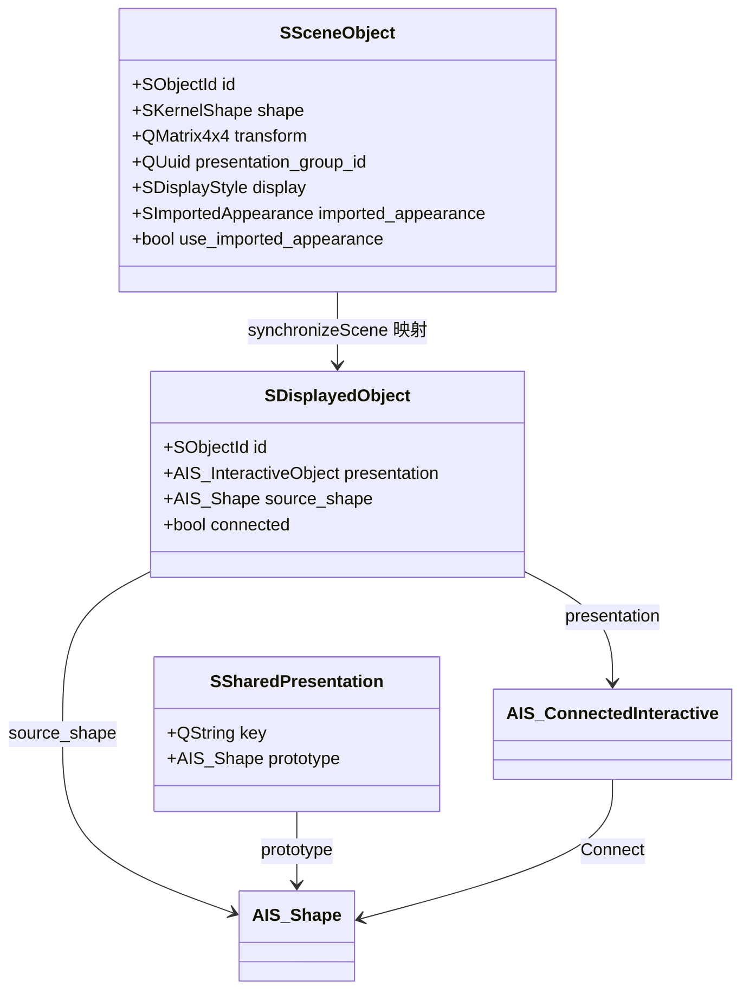

## 2. 核心不变量

共享实例实现依赖以下不变量：

1. 每个业务对象的 `id` 唯一且非空。
2. 每个带 Shape 的对象必须具有非空 `presentation_group_id`。
3. 同一个 `presentation_group_id` 内的对象必须拥有相同基础几何。
4. 共享复制继承源显示组；普通复制生成新显示组。
5. 每个实例保存独立 `QMatrix4x4`，基础 Shape 不写入实例位置。
6. 只有显示组、底层 TShape、有效颜色、透明度、视口显示模式和导入外观都兼容的对象
   才能共享同一个 AIS 原型。
7. 一个兼容分组只有一个可见对象时，使用独立 `AIS_Shape`，不创建无收益的 Connected。
8. 多成员分组中的原型不作为业务对象直接显示，只显示 Connected 实例。
9. 选择必须先定位具体 Connected/独立 Presentation，再恢复业务对象 ID。
10. 删除场景时必须先 `Disconnect()` Connected，再移除实例，最后移除原型。
11. 共享组的平移、旋转只更新实例矩阵；缩放和拓扑编辑必须物化独立 Shape。
12. `.sg3d` 加载时同组 BREP 数据不一致必须拒绝，不能创建错误共享。

## 3. 相关生产源码文件

### 3.1 Core 与 Kernel

| 文件 | 在共享实例中的职责 |
| --- | --- |
| [`s_types.h`](../sgraphCore/s_types.h) | 定义 `SCopyMode`、显示模式、整体样式和导入外观值类型 |
| [`s_transform_utils.h`](../sgraphCore/s_transform_utils.h) | 声明仿射、相似和刚性变换验证函数 |
| [`s_transform_utils.cpp`](../sgraphCore/s_transform_utils.cpp) | 验证实例矩阵有限性、正交轴和统一尺度，拒绝剪切/退化矩阵 |
| [`s_kernel_shape.h`](../sgraphKernel/s_kernel_shape.h) | 定义共享 PImpl 的 `SKernelShape` 值对象 |
| [`s_kernel_shape.cpp`](../sgraphKernel/s_kernel_shape.cpp) | 用 `shared_ptr<SImpl>` 持有 `TopoDS_Shape`，实现复制共享 |
| [`s_kernel_shape_access.h`](../sgraphKernel/s_kernel_shape_access.h) | 允许 Render/Kernel/IO 受控访问原生 `TopoDS_Shape` |
| [`s_kernel_service.h`](../sgraphKernel/s_kernel_service.h) | 声明 `transform()` 和 `materialize()` 等几何接口 |
| [`s_kernel_service.cpp`](../sgraphKernel/s_kernel_service.cpp) | 物化场景矩阵或生成独立变换 Shape，供预览和解除共享使用 |

### 3.2 Document

| 文件 | 在共享实例中的职责 |
| --- | --- |
| [`s_scene_object.h`](../sgraphDocument/s_scene_object.h) | 保存业务 ID、Shape、实例矩阵、显示组和外观状态 |
| [`s_3d_document.h`](../sgraphDocument/s_3d_document.h) | 声明复制、变换、显示组统计、批量提交和事务 API |
| [`s_3d_document.cpp`](../sgraphDocument/s_3d_document.cpp) | 实现可见性、整体显示样式和 Undo/Redo；状态变化会触发共享场景重新分组或重建 |
| [`s_3d_document_copy.cpp`](../sgraphDocument/s_3d_document_copy.cpp) | 实现普通/共享复制、实例矩阵更新和显示组成员统计 |
| [`s_3d_document_batch.cpp`](../sgraphDocument/s_3d_document_batch.cpp) | 原子添加共享阵列结果和派生对象 |
| [`s_3d_document_appearance.cpp`](../sgraphDocument/s_3d_document_appearance.cpp) | 整体改色和恢复导入色；保留显示组，由 Render 根据新外观重新拆组 |
| [`s_3d_document_state.cpp`](../sgraphDocument/s_3d_document_state.cpp) | 通用事务、Undo/Redo 状态捕获、快照和加载替换 |

### 3.3 GUI 用例层

| 文件 | 在共享实例中的职责 |
| --- | --- |
| [`s_main_window.h`](../sgraphGui/s_main_window.h) | 声明复制、阵列、多 Shape 任务、物化和变换用例接口 |
| [`s_main_window.cpp`](../sgraphGui/s_main_window.cpp) | 创建“普通复制”和“实例复制”动作及快捷键 |
| [`s_main_window_object_actions.cpp`](../sgraphGui/s_main_window_object_actions.cpp) | 生成复制预览并调用 Document 复制接口 |
| [`s_main_window_arrays.cpp`](../sgraphGui/s_main_window_arrays.cpp) | 生成线性/圆周阵列预览 Shape 和最终实例矩阵 |
| [`s_main_window_tasks.cpp`](../sgraphGui/s_main_window_tasks.cpp) | 后台生成阵列预览；共享模式提交时重新使用源 Shape 和显示组 |
| [`s_main_window_transform.cpp`](../sgraphGui/s_main_window_transform.cpp) | 平移/旋转保持共享，缩放或非共享对象走物化派生路径 |
| [`s_main_window_model.cpp`](../sgraphGui/s_main_window_model.cpp) | 在属性面板显示“共享实例（N 个对象）”或“独立显示” |

### 3.4 Render

| 文件 | 在共享实例中的职责 |
| --- | --- |
| [`s_occ_viewport.h`](../sgraphRender/s_occ_viewport.h) | 声明场景同步、选择和资源统计公共接口 |
| [`s_occ_viewport_p.h`](../sgraphRender/s_occ_viewport_p.h) | 定义 `SDisplayedObject`、`SSharedPresentation` 和 AIS 私有所有权 |
| [`s_occ_viewport.cpp`](../sgraphRender/s_occ_viewport.cpp) | 文档绑定、显示模式、选择设置、业务 ID 和子形状回映 |
| [`s_occ_viewport_scene.cpp`](../sgraphRender/s_occ_viewport_scene.cpp) | 构造共享键、AIS 原型/Connected、彩色原型、清理和资源统计 |
| [`s_occ_viewport_events.cpp`](../sgraphRender/s_occ_viewport_events.cpp) | 初始化 Context、发送选择并对共享原型统一切换交互质量 |
| [`s_render_quality.h`](../sgraphRender/s_render_quality.h) | 声明大网格阈值和交互/静止偏差系数策略 |
| [`s_render_quality.cpp`](../sgraphRender/s_render_quality.cpp) | 根据三角形数决定是否渐进显示，并返回原型网格偏差系数 |

### 3.5 IO

| 文件 | 在共享实例中的职责 |
| --- | --- |
| [`s_project_codec.h`](../sgraphIo/s_project_codec.h) | 声明 `.sg3d` 保存和加载入口 |
| [`s_project_codec.cpp`](../sgraphIo/s_project_codec.cpp) | 保存显示组/矩阵；加载时校验同组 BREP 并复用 `SKernelShape` |
| [`s_project_validation.h`](../sgraphIo/s_project_validation.h) | 声明纯业务对象结构验证接口 |
| [`s_project_validation.cpp`](../sgraphIo/s_project_validation.cpp) | 拒绝带 Shape 但无显示组、非法矩阵和其他损坏对象元数据 |

## 4. Core 与 Kernel 接口

### 4.1 复制模式

文件：`sgraphCore/s_types.h`

```cpp
enum class SCopyMode
{
    IndependentPresentation,
    SharedPresentation
};
```

- `IndependentPresentation`：新业务对象获得新 `presentation_group_id`。
- `SharedPresentation`：新业务对象保留源 `presentation_group_id`。
- 枚举只表达业务意图；是否真正形成 Connected 由 Render 根据可见成员和兼容键决定。

### 4.2 `SKernelShape`

```cpp
class SKernelShape
{
  public:
    SKernelShape(const SKernelShape&);
    SKernelShape& operator=(const SKernelShape&);
    bool isNull() const;
    bool isValid() const;

  private:
    struct SImpl;
    std::shared_ptr<SImpl> m_impl;
};
```

复制 `SSceneObject` 会复制 `SKernelShape`，进而复制 `shared_ptr<SImpl>`，不会立即复制
`TopoDS_Shape`。这是普通复制和共享实例都具有的基础几何共享；两种模式的差异发生在
`presentation_group_id` 和 AIS 层。

### 4.3 变换验证

```cpp
bool isFiniteAffineTransform(const QMatrix4x4& transform);
bool isSimilarityTransform(const QMatrix4x4& transform);
bool isRigidTransform(const QMatrix4x4& transform);
```

- `isFiniteAffineTransform()`：检查所有矩阵值有限并且末行为合法仿射形式。
- `isSimilarityTransform()`：在仿射基础上要求三个轴互相正交且尺度相同，允许统一缩放。
- `isRigidTransform()`：在相似变换基础上要求尺度为 1。
- `S3dDocument::setObjectTransform()` 当前使用相似变换验证，因此核心文档接口允许统一缩放；
  “共享实例缩放必须物化”由 GUI 用例层保证。

### 4.4 Shape 物化接口

```cpp
virtual SResult<SKernelShape> materialize(
    const SKernelShape& input,
    const QMatrix4x4& transform) const = 0;

virtual SResult<SKernelShape> transform(
    const SKernelShape& input,
    const STransformParameters& parameters) const = 0;
```

`materialize()` 把对象基础 Shape 与场景矩阵合成独立 Shape；单位矩阵时可以直接返回输入。
`transform()` 生成包含平移、旋转和统一缩放的新几何。GUI 用它们生成预览、普通阵列 Shape
以及共享实例解除共享后的派生 Shape。失败返回 `InvalidArgument` 或 `GeometryFailure`，不把
`Standard_Failure` 传播到 GUI。

## 5. Document 接口与实现

### 5.1 `SSceneObject` 相关字段

```cpp
struct SSceneObject
{
    SObjectId id = QUuid::createUuid();
    SKernelShape shape;
    QList<SObjectId> derived_from;
    QMatrix4x4 transform;
    QUuid presentation_group_id = QUuid::createUuid();
    SDisplayStyle display;
    SImportedAppearance imported_appearance;
    bool use_imported_appearance = false;
    bool visible = true;
    bool locked = false;
    bool frozen = false;
};
```

| 字段 | 共享语义 |
| --- | --- |
| `id` | 每个副本重新生成，确保业务身份独立 |
| `shape` | 共享复制和直接普通复制都可能共享 PImpl |
| `derived_from` | 副本记录源对象 ID |
| `transform` | 每个实例独立保存，不修改基础 Shape |
| `presentation_group_id` | 普通复制换组，共享复制继承；Render 分组的第一维 |
| `display` | 整体颜色、透明度和持久化显示模式 |
| 导入外观字段 | 参与共享显示键；不同外观自动拆分原型 |
| `visible/frozen` | 可见性决定分组成员；冻结决定 AIS 是否允许选择 |

### 5.2 `copyObjects()`

文件：`sgraphDocument/s_3d_document_copy.cpp`

```cpp
SResult<QList<SObjectId>> copyObjects(
    const QList<SObjectId>& ids,
    SCopyMode mode,
    QString operation_name,
    QString parameter_summary = {});
```

调用者：`SMainWindow::duplicateSelectionWithMode()`。

实现步骤：

1. 拒绝空 ID 列表。
2. 对每个 ID 查找源对象，拒绝不存在或无几何对象。
3. `SSceneObject copy = *source`，复制 Shape、矩阵、显示组、外观和其他业务字段。
4. 生成新业务 ID，名称追加“实例”或“副本”。
5. 阶段改为 `Working`，解除锁定和外部引用，记录 `derived_from`。
6. 普通模式生成新显示组；共享模式保留复制得到的源显示组。
7. 把所有副本交给 `addObjects()` 一次提交，形成一条 Undo 记录。

成功返回所有新业务 ID。任一源无效时整批失败，不产生部分副本。

### 5.3 `setObjectTransform()`

```cpp
SResult<void> setObjectTransform(
    const SObjectId& id,
    const QMatrix4x4& transform,
    QString operation_name = {});
```

调用者：共享对象的 `SMainWindow::runTransform()`。

前置条件：矩阵必须是有限相似变换；对象必须存在且未锁定。矩阵未变化时直接成功，不创建
Undo。成功时只更新 `SSceneObject::transform` 和修改时间，保留 Shape、显示组及外观，然后
通过通用 `commit()` 触发 `documentChanged`。

### 5.4 `presentationGroupMemberCount()`

```cpp
int presentationGroupMemberCount(const QUuid& group_id) const;
```

遍历全部文档对象，统计显示组相同且 Shape 非空的对象。它不检查可见性和有效外观，也不
等同于当前 Connected 数量。GUI 用它判断某对象是否属于多成员共享组，属性面板用它显示
成员数量。

### 5.5 批量添加与事务

```cpp
SResult<QList<SObjectId>> addObjects(
    QList<SSceneObject> objects,
    QString operation_name,
    QString parameter_summary = {});

SResult<QList<SObjectId>> addDerivedObjects(
    const QList<SObjectId>& inputs,
    QList<SSceneObject> results,
    QString operation_name,
    bool replace_inputs = false,
    QString parameter_summary = {});
```

`copyObjects()` 使用 `addObjects()`；共享阵列使用 `addDerivedObjects()`。批量接口先验证整批
对象 ID、Shape、输入引用和锁定状态，然后通过一次 `commit()` 添加全部对象。mutation
返回失败时 Document 恢复提交前状态；成功时写入一条 Undo、历史、revision 和 dirty。

### 5.6 外观修改与自动拆组

```cpp
SResult<void> setObjectColors(const QList<SObjectId>& ids, const QColor& color);
SResult<void> restoreImportedAppearances(const QList<SObjectId>& ids);
```

两者都不直接修改 `presentation_group_id`：

- 整体改色更新 `display.color` 并关闭 `use_imported_appearance`。
- 恢复颜色重新启用已经保存的导入外观。
- commit 发出 `documentChanged` 后，Render 重新计算包含外观的 `presentationKey()`。
- 外观不同的对象自然进入不同运行时分组；重新变得兼容时也可以再次共用原型。

### 5.7 Undo、Redo 和快照

Document 捕获的 `SSceneObject` 值状态包含 Shape、矩阵、显示组和外观，因此共享复制、实例
变换、改色和恢复颜色都能随 Undo/Redo 恢复。命名快照同样保存这些字段。Undo 栈只存在于
当前进程；`.sg3d` 重开依靠项目字段恢复共享关系。

`s_3d_document.cpp` 中的可见性操作、`setDisplayStyle()`、`undo()` 和 `redo()` 也通过
`commit()` 或状态恢复发出文档变化信号。`setDisplayStyle()` 会关闭
`use_imported_appearance`；显示组 ID 不变，但颜色、透明度或导入外观状态改变后，Render
会得到不同的共享键。隐藏对象不会进入本轮可见对象分组；Undo/Redo 恢复旧对象状态后会整场
重新同步。

## 6. GUI 调用入口与实现

### 6.1 动作入口

文件：`sgraphGui/s_main_window.cpp`

```cpp
void duplicateSelection();
void duplicateSelectionShared();
void duplicateSelectionWithMode(SCopyMode mode);
```

- 普通复制快捷键为 `Ctrl+D`。
- 实例复制快捷键为 `Ctrl+Shift+D`。
- 两个 QAction 最终进入同一个 `duplicateSelectionWithMode()`，避免两套复制流程分叉。

### 6.2 `duplicateSelectionWithMode()`

文件：`sgraphGui/s_main_window_object_actions.cpp`

实现过程：

1. 获取场景树/视口当前选中业务 ID。
2. 对每个源对象调用 `materializedShape()`，只用于生成位置正确的预览。
3. 用 `SIKernelService::makeCompound()` 合并预览 Shape。
4. `confirmShapePreview()` 在全部视口显示临时预览并等待用户确认。
5. 确认后调用 `m_document.copyObjects(ids, mode, operation)`。

关键点：预览物化不等于正式结果物化。共享复制正式提交仍复制源 `SKernelShape` 和场景矩阵，
不会把预览 compound 写入文档。

### 6.3 线性和圆周阵列

```cpp
void runLinearArray();
void runPolarArray();
```

两个入口先询问普通/共享模式、数量和阵列参数，然后：

- 计算 `instance_transforms`，它是共享模式最终业务矩阵的来源。
- 后台逐项调用 Kernel `transform()` 生成临时 Shape，供两种模式共同预览。
- 把 Shape 列表、复制模式和实例矩阵交给 `runMultiShapeTask()`。

因此共享阵列的后台预览仍生成逐项变换几何；这些临时 Shape 不会成为共享模式的最终基础
Shape。

### 6.4 `runMultiShapeTask()`

```cpp
void runMultiShapeTask(
    QString task_name,
    SObjectId input,
    QString result_prefix,
    QString parameter_summary,
    std::function<SResult<QList<SKernelShape>>(const STaskContext&)> work,
    SCopyMode copy_mode = SCopyMode::IndependentPresentation,
    QList<QMatrix4x4> instance_transforms = {});
```

后台阶段：执行 `work()` 生成预览 Shape，构造 compound 预览，支持协作取消。

GUI 完成回调阶段：

1. 用户确认预览。
2. 重新查找源对象，防止后台期间源对象被删除。
3. 共享模式校验实例矩阵数量与 Shape 结果数量一致。
4. 共享模式以 `SSceneObject object = *source` 开始，保留源 Shape、显示组和外观。
5. 为每个结果生成新 ID、名称并清除锁定/外部引用。
6. 正式 `object.shape` 使用 `source->shape`，不使用后台生成的临时 Shape。
7. 正式矩阵为 `instance_transform * source->transform`。
8. 一次 `addDerivedObjects()` 提交全部实例。

普通模式使用后台生成的独立 Shape；如果面数量变化导致导入外观不能安全映射，则清除面
覆盖并回退主色。

### 6.5 变换与解除共享

文件：`sgraphGui/s_main_window_transform.cpp`

```cpp
SResult<SKernelShape> materializedShape(const SSceneObject& object) const;
void runTransform();
```

`runTransform()` 先通过 `presentationGroupMemberCount()` 判断是否属于多成员组：

- 多成员且统一缩放等于 1：构造平移/绕 Z 旋转 delta，计算新矩阵，预览物化结果，确认后
  调用 `setObjectTransform()`；基础 Shape 和显示组不变。
- 统一缩放不为 1，或者对象不属于多成员组：先 `materializedShape()`，再通过后台
  `runShapeTask()` 生成派生 Shape。新对象使用独立显示组，不再复用旧原型。

这里的“共享”按文档显示组成员数判断，不按当前可见 Connected 数判断。

### 6.6 属性展示

`s_main_window_model.cpp` 调用：

```cpp
const int presentation_members =
    m_document.presentationGroupMemberCount(object->presentation_group_id);
```

成员数大于 1 显示“共享实例（N 个对象）”，否则显示“独立显示”。这是文档语义展示，不是
直接读取当前 AIS 统计，因此隐藏成员或外观拆组后仍可能显示同一个业务显示组。

## 7. Render 接口与实现

### 7.1 私有运行时结构

```cpp
struct SDisplayedObject
{
    SObjectId id;
    Handle(AIS_InteractiveObject) presentation;
    Handle(AIS_Shape) source_shape;
    bool connected = false;
    bool progressive = false;
    bool frozen = false;
    int triangle_count = 0;
};

struct SSharedPresentation
{
    QString key;
    Handle(AIS_Shape) prototype;
    bool progressive = false;
    int triangle_count = 0;
};
```

`presentation` 是实际显示和命中的对象；共享模式下它是 Connected。`source_shape` 是选择
拓扑映射使用的原型 Shape。`SSharedPresentation` 单独持有原型，保证所有实例存在期间原型
不会释放。

### 7.2 文档绑定

```cpp
void SOccViewport::setDocument(S3dDocument* document);
```

Viewport 保存非拥有文档指针，断开旧文档连接，连接新文档的 `documentChanged` 到
`synchronizeScene()`，随后立即同步。业务变换、可见性、颜色、复制、删除和 Undo 都通过
同一信号触发显示重建。

### 7.3 共享分组键

文件：`sgraphRender/s_occ_viewport_scene.cpp`

```cpp
QString presentationKey(const SSceneObject& object, SDisplayMode mode);
```

键由七部分组成：

```text
presentation_group_id
object.display.color.rgba()
有效透明度
当前 Viewport 显示模式
底层 TShape 指针身份
use_imported_appearance
importedAppearanceHash
```

有效透明度在透明显示模式下固定为 `0.65`。外观指纹包含基础样式，以及每个面覆盖的索引、
颜色和纳米级量化透明度。

注意：键中的显示模式参数来自 `SOccViewport::m_impl->display_mode`，不是逐对象
`object.display.mode`。当前显示模式是视口全局状态。

### 7.4 `configurePresentation()`

```cpp
void configurePresentation(
    const Handle(AIS_Shape)& presentation,
    const SSceneObject& object,
    SDisplayMode mode);
```

实现行为：

1. 选择整体 `SDisplayStyle` 或导入外观基础样式。
2. 设置原型颜色和有效透明度。
3. 如果启用导入外观，把 Shape 向下转换为 `AIS_ColoredShape`。
4. 建立从 1 开始的面 map，应用每个面的自定义颜色和透明度。
5. 设置线框/着色显示模式和面边界绘制。

共享彩色对象共用一个 `AIS_ColoredShape` 原型；Connected 本身不重复设置每个面的颜色。

### 7.5 `synchronizeScene()`

```cpp
void SOccViewport::synchronizeScene();
```

执行步骤：

1. Viewport 未初始化或 Context 为空时直接返回。
2. 调用 `clearScenePresentations()` 清理旧运行时 AIS。
3. 遍历 Document 对象；测量对象单独创建文本标签。
4. 对可见且 Shape 非空的对象计算 `presentationKey()` 并放入 `QMap` 分组。
5. 每组使用第一个对象的 Shape 创建 `AIS_Shape` 或 `AIS_ColoredShape` 原型。
6. 配置外观、计算三角形并设置渐进质量。
7. 组内只有一个对象：把对象矩阵设置到原型，直接显示原型并记录为独立 Presentation。
8. 组内两个以上对象：保存原型，但不直接显示；每个对象创建 Connected，连接原型和自身
   矩阵，显示 Connected 并记录业务 ID 映射。
9. 恢复选择模式；冻结对象停用选择。
10. 一次刷新 Viewer。

矩阵转换为 `gp_Trsf` 失败时，独立对象重置矩阵；Connected 则退回无矩阵连接。Document 和
GUI 已提前验证矩阵，因此这属于最后的防御路径。

### 7.6 清理顺序

```cpp
void SOccViewport::clearScenePresentations();
```

严格顺序：

1. 遍历 `SDisplayedObject`。
2. 对 `connected=true` 的对象向下转换并调用 `Disconnect()`。
3. 从 Context 移除所有实例或独立 Presentation。
4. 移除 `SSharedPresentation::prototype`。
5. 移除测量标签和预览。
6. 清空三个容器。

先释放原型会让仍连接的实例引用无效，所以 Disconnect 必须发生在移除原型之前。

### 7.7 对象选择和子形状映射

```cpp
void setSelectedObjects(const QList<SObjectId>& ids);
QList<SObjectId> selectedObjectIds() const;
QList<SSelection> selectedSelections() const;
```

程序化选择按业务 ID 找到 `SDisplayedObject`，向 Context 传入实际 `presentation`，所以共享
对象选中的是具体 Connected。

读取选择时：

1. 从 Context 取得 `SelectedInteractive()`。
2. 与 `SDisplayedObject::presentation` 做 handle 比较，定位具体业务对象。
3. 对象模式直接返回业务 ID。
4. 子形状模式取得 `SelectedShape()`。
5. 按所选 Shape 类型映射 `displayed.source_shape->Shape()` 的拓扑。
6. 使用 `map(index).IsPartner(selected_shape)` 忽略实例 Location 差异，找回一基索引。
7. 返回 `SSelection{object_id, mode, sub_shape_index}`。

### 7.8 显示模式与渐进质量

`setDisplayMode()` 同时更新独立 `source_shape` 和所有共享原型。交互质量切换也分别处理独立
Shape 与 `shared_presentations` 原型，避免为每个 Connected 重复设置网格偏差。

`SRenderQualityPolicy` 提供两项静态策略：

```cpp
static bool shouldUseProgressiveRendering(int triangle_count);
static double deviationCoefficient(bool interaction_preview);
```

- 三角形数达到 `kLargeMeshTriangleCount = 200000` 时启用渐进显示。
- 交互预览偏差系数为 `0.08`，静止精细显示为 `0.005`。
- 共享模式对原型设置质量，Connected 自动复用原型显示数据；不会逐实例重新三角化。

### 7.9 资源统计

```cpp
SRenderResourceStatistics renderResourceStatistics() const;
```

统计规则：

- `connected_instances`：`SDisplayedObject::connected=true` 的数量。
- `independent_presentations`：直接显示 Shape 的数量。
- `shared_prototypes`：共享原型容器大小。
- `colored_prototypes`：独立或共享的 `AIS_ColoredShape` 数量。
- `rendered_triangles`：按每个业务显示对象展开后的三角形总量。
- `estimated_gpu_geometry_bytes`：独立 Shape 各计一次，共享原型只计一次。
- `graphic_structures`：独立 Presentation、共享原型、Connected 的数量之和。

该接口只读运行时结构，不修改 Document。

## 8. IO 持久化实现

### 8.1 保存字段

`objectToJson()` 为每个对象保存：

```text
id
transform
presentationGroupId
color / transparency / displayMode
importedAppearance / useImportedAppearance
shapeSize
derivedFrom
其他场景对象元数据
```

Shape BREP 仍按每个对象分别写入。因此当前 `.sg3d` 保存没有按显示组做磁盘几何去重，运行时
共享不等于项目文件只保存一份 BREP。

### 8.2 加载字段

`objectFromJson()` 恢复实例矩阵、显示组和外观。若 `presentationGroupId` 缺失或为空，保留
`SSceneObject` 构造时生成的新 UUID，相当于独立显示候选。

### 8.3 同组几何校验与复用

`SProjectCodec::load()` 为普通对象和快照分别维护：

```cpp
QHash<QUuid, QByteArray> presentation_group_data;
QHash<QUuid, SKernelShape> presentation_group_shapes;
```

对每个对象：

1. 读取声明长度对应的 BREP 字节。
2. 查找同一 `presentation_group_id` 已读取的数据。
3. 若同组已有数据但字节不同，返回 `CorruptData`：“共享显示组包含不一致的基础几何”。
4. 若字节相同，直接复用已经反序列化的 `SKernelShape`。
5. 若首次出现该组，反序列化 Shape 并写入两个 map。

所有对象、坐标系和快照校验成功后才调用 `replaceAll()`，不会把半个损坏项目覆盖到当前
Document。

### 8.4 结构验证

```cpp
SResult<void> projectValidation::validateObjects(
    const std::vector<SSceneObject>& objects,
    const std::vector<SCoordinateSystem>& coordinate_systems);
```

共享相关校验包括：带非空 Shape 的对象必须有非空显示组，实例矩阵必须是合法相似变换，
显示模式、颜色、透明度和导入外观必须有效。同组几何一致性需要原始 BREP 字节，因此由
`SProjectCodec::load()` 完成，而不在纯业务验证函数内完成。

## 9. 完整调用关系与流程图

### 9.1 直接实例复制

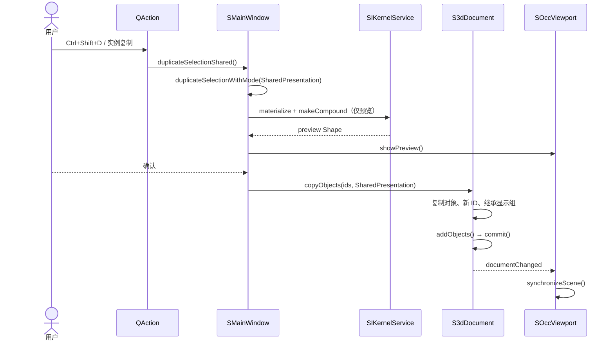

### 9.2 Document 复制决策

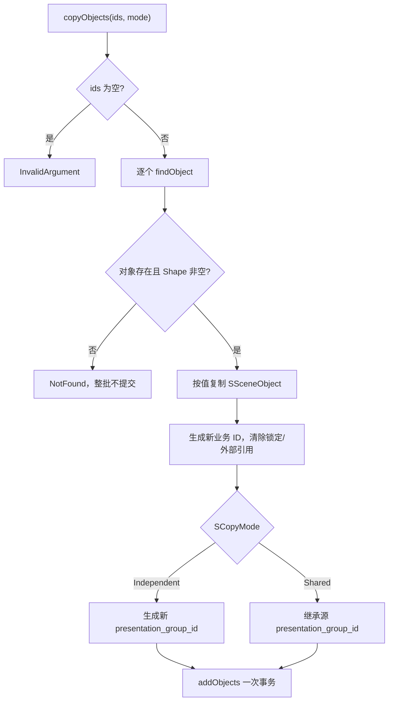

### 9.3 共享阵列

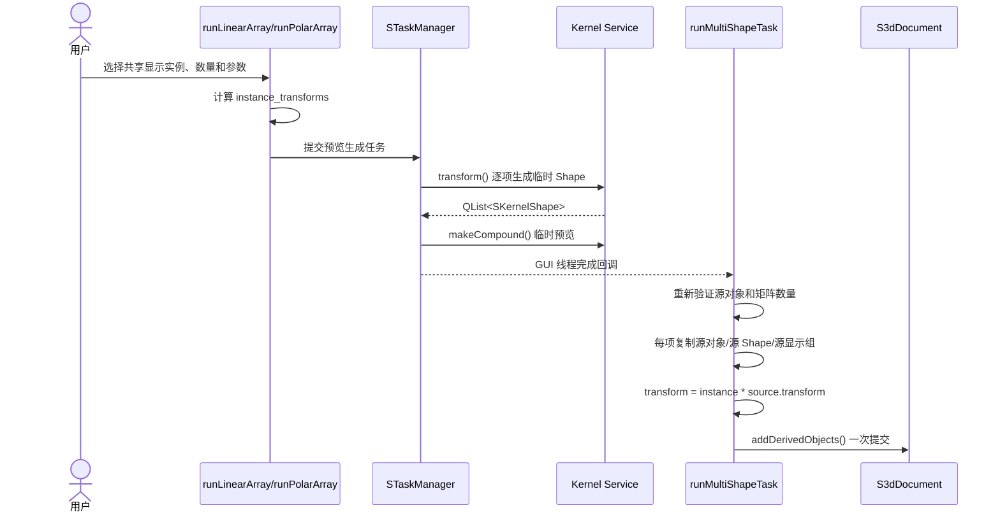

### 9.4 AIS 场景同步

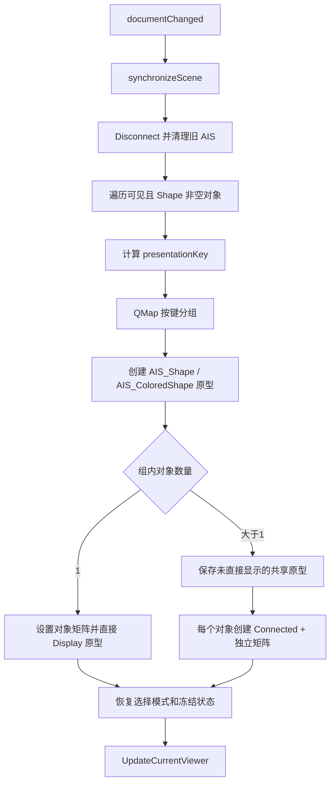

### 9.5 共享键与自动拆组

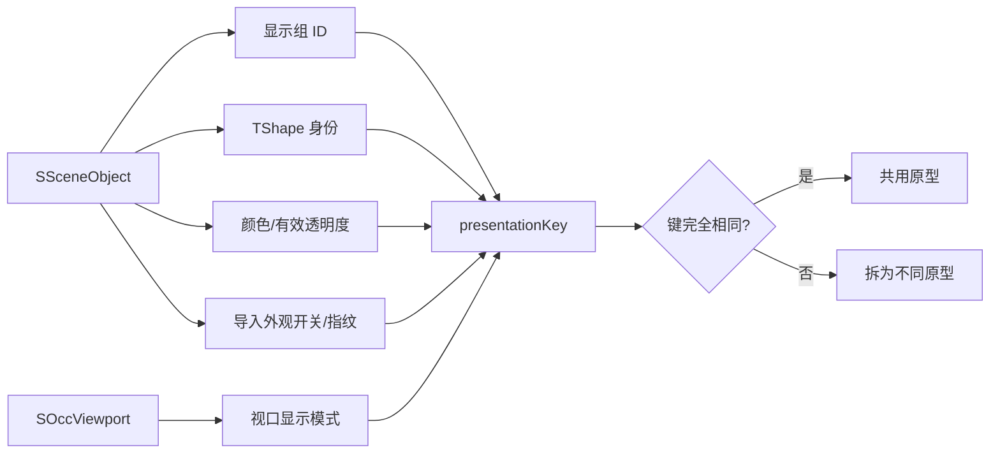

### 9.6 选择映射

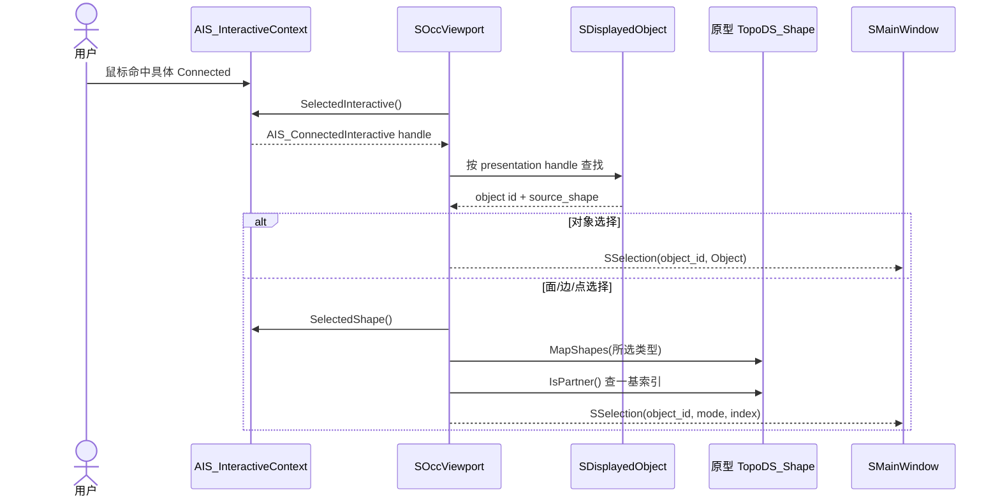

### 9.7 变换与解除共享

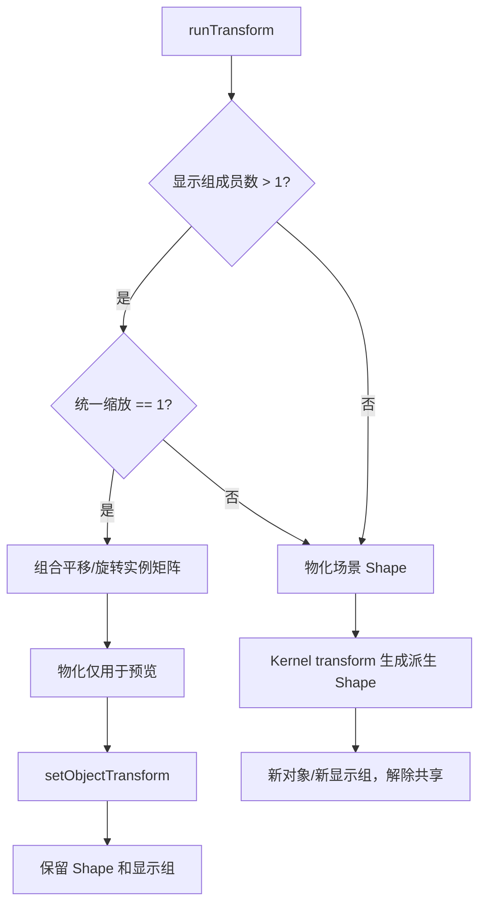

### 9.8 可见性和单成员退化

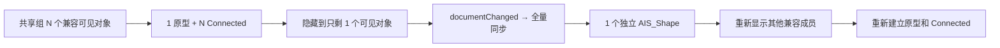

业务 `presentation_group_id` 在整个过程中不变，变化的是 Viewport 的运行时结构。

### 9.9 保存和加载

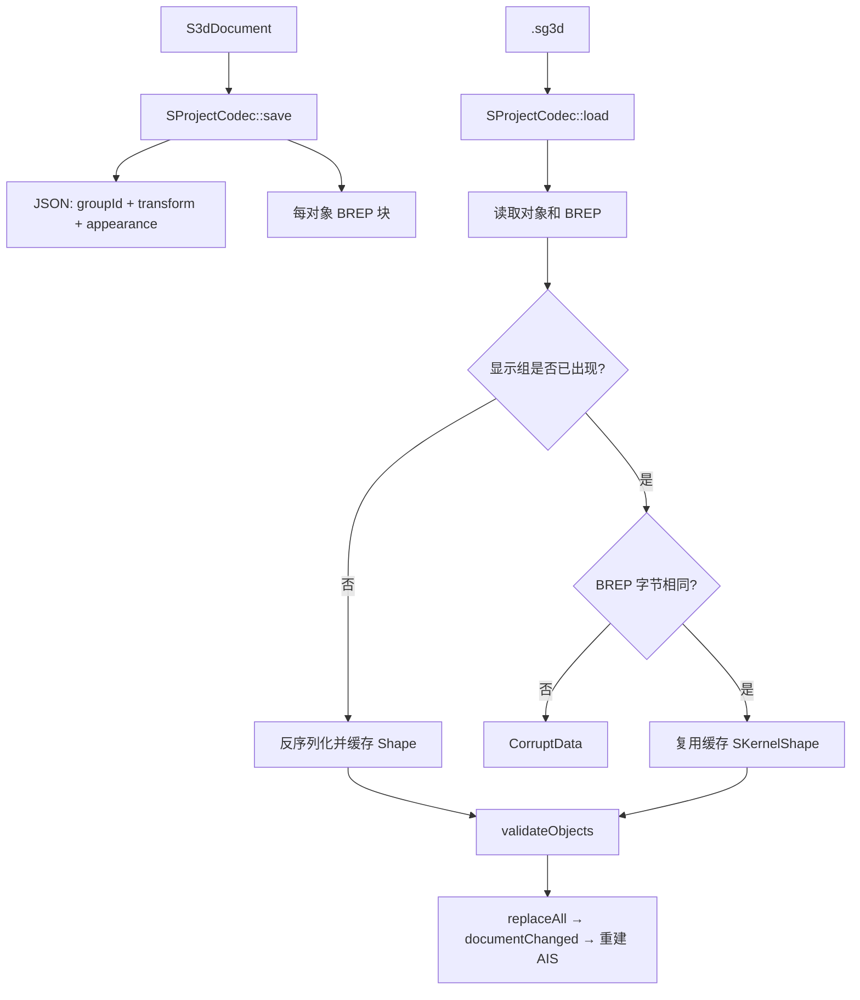

### 9.10 资源清理

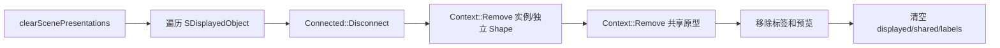

## 10. 实现方法与失败处理

### 10.1 为什么同时检查显示组和 TShape

显示组表达业务共享意图，但不能单独证明几何相同。`presentationKey()` 还加入底层 TShape
身份；项目加载进一步比较同组 BREP 字节。这样即使损坏数据或错误调用把不同几何放入同一
组，也不会在 Render 中共用错误原型。

### 10.2 为什么单成员使用独立 Shape

只有一个可见成员时，Connected 会额外增加一个实例对象和连接结构，却不能减少原型数量。
因此单成员直接显示原型。第二个兼容成员出现后，下一次场景同步才转换为共享原型和两个
Connected。

### 10.3 为什么外观参与分组键

AIS 原型保存颜色、透明度、面级覆盖和显示方式。外观不同却共用原型会导致一个实例的改色
影响其他实例。把有效外观纳入键后，Document 无需主动修改显示组，Render 即可自动拆分。

### 10.4 为什么选择保存 `source_shape`

Connected 自身代表实例位置，面/边/点拓扑来自原型。`SDisplayedObject` 同时保存实际命中
Presentation 和原型 `source_shape`，从而先恢复业务对象，再从原型拓扑找到索引。
`IsPartner` 只比较底层 TShape 伙伴关系，可以忽略实例 Location。

### 10.5 线程边界

- Document 和 Viewport 修改发生在 GUI 线程。
- 阵列的临时 Shape 生成在 `STaskManager` 后台单槽任务中。
- 后台工作函数不访问 QWidget，也不提交 Document。
- watcher 完成回调回到 GUI 线程后重新验证源对象，再一次提交正式共享结果。
- 任务取消后临时结果不进入文档。

### 10.6 主要失败路径

| 位置 | 失败条件 | 结果 |
| --- | --- | --- |
| `copyObjects()` | 空选择、源不存在或无 Shape | 整批失败，无对象创建 |
| `setObjectTransform()` | 非相似矩阵、对象缺失或锁定 | 不改变实例矩阵 |
| `runMultiShapeTask()` | 任务取消、源已失效、矩阵数量不匹配 | 不提交阵列 |
| `presentationKey()` 前 | Shape 为空 | 对象不进入显示分组 |
| `toOccTransform()` | OCCT 拒绝矩阵 | 独立对象重置变换；Connected 退回无矩阵连接 |
| 选择映射 | 未找到 `IsPartner` | 仍返回业务对象，子形状索引保持无效值 |
| 项目加载 | 同显示组 BREP 不同 | 返回 `CorruptData`，当前文档不被替换 |
| 项目验证 | Shape 非空但显示组为空、矩阵非法 | 拒绝加载 |

## 11. 当前实现边界

1. `synchronizeScene()` 对普通文档变化执行全量清场和重建，尚未做对象级 AIS 增量更新。
2. `.sg3d` 保存仍按对象重复写 BREP；只有加载后的内存 Shape 按显示组复用。
3. 共享阵列正式结果复用源 Shape，但后台预览仍逐项生成临时变换 Shape。
4. `S3dDocument::setObjectTransform()` 允许统一缩放；共享实例缩放物化主要由 GUI 保证。
5. `presentationGroupMemberCount()` 统计文档组成员，不等于当前可见 Connected 数量。
6. 对象的 `display.mode` 会持久化，但当前共享键使用 Viewport 全局显示模式。
7. 一个共享业务组可能因颜色、透明度或导入外观不同同时对应多个运行时原型。
8. 平移/旋转保持共享；布尔、圆角、倒角、孔、截面等拓扑变化生成独立 Shape。
9. 运行时 Undo 能恢复显示组和矩阵，但项目重开不会恢复上一次进程的 Ctrl+Z 栈。

## 12. 核心源码索引

```text
sgraphCore/s_types.h
sgraphCore/s_transform_utils.h
sgraphCore/s_transform_utils.cpp

sgraphKernel/s_kernel_shape.h
sgraphKernel/s_kernel_shape.cpp
sgraphKernel/s_kernel_shape_access.h
sgraphKernel/s_kernel_service.h
sgraphKernel/s_kernel_service.cpp

sgraphDocument/s_scene_object.h
sgraphDocument/s_3d_document.h
sgraphDocument/s_3d_document.cpp
sgraphDocument/s_3d_document_copy.cpp
sgraphDocument/s_3d_document_batch.cpp
sgraphDocument/s_3d_document_appearance.cpp
sgraphDocument/s_3d_document_state.cpp

sgraphGui/s_main_window.h
sgraphGui/s_main_window.cpp
sgraphGui/s_main_window_object_actions.cpp
sgraphGui/s_main_window_arrays.cpp
sgraphGui/s_main_window_tasks.cpp
sgraphGui/s_main_window_transform.cpp
sgraphGui/s_main_window_model.cpp

sgraphRender/s_occ_viewport.h
sgraphRender/s_occ_viewport_p.h
sgraphRender/s_occ_viewport.cpp
sgraphRender/s_occ_viewport_scene.cpp
sgraphRender/s_occ_viewport_events.cpp
sgraphRender/s_render_quality.h
sgraphRender/s_render_quality.cpp

sgraphIo/s_project_codec.h
sgraphIo/s_project_codec.cpp
sgraphIo/s_project_validation.h
sgraphIo/s_project_validation.cpp
```
